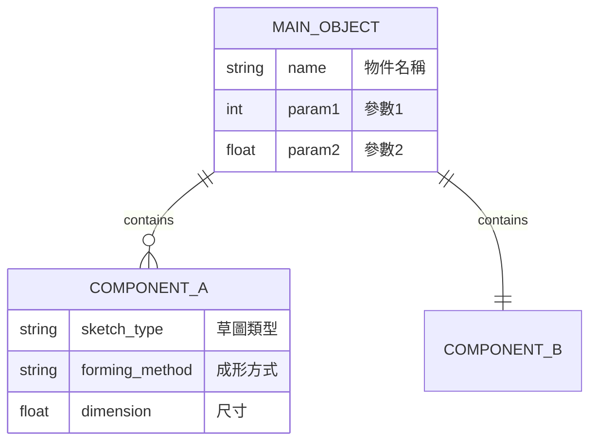
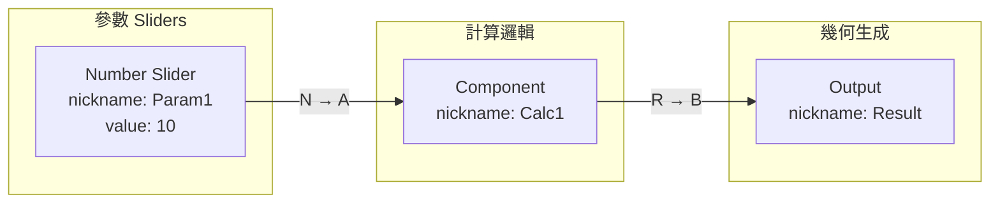

# /grasshopper — 三軌智能工作流程

## 核心理念

**Reference First**：不讓 Claude 猜測，而是找到成功案例後複製和微調。

```
「找到 → 確認 → 複製 → 微調」vs 舊的「猜測 → 失敗 → 調試 → 重複」
```

**三軌架構**（優先順序）：
1. **Reference Mode**: 搜索 Reference Library，使用驗證過的 Golden Config
2. **Workflow Mode**: 確定性 6 階段管線，適合已知模式
3. **Meta-Agent Mode**: 彈性探索，適合未知情況

---

## Reference Mode (優先) - v2.1 整合版

### 觸發條件

當 Reference Library 有高信心度匹配（≥ 0.8）時自動使用。

### 流程 (v2.1 優化版)

```
用戶請求
    ↓
【Phase 1: Router】兩階段路由
    ├── Stage 1: Reference Match (≥0.8 直接使用)
    └── Stage 2: 三維評估 (Intent + Tool + Pattern)
    ↓ 有匹配
【Phase 2: Confirm】使用 AskUserQuestion 確認
    ↓ 確認
【Phase 3: Pre-Check】語法檢查 (快速、不用 LLM)
    ↓ 通過
【Phase 4: Semantic Review】語義審查 (LLM 自我對話)
    ↓ 通過
【Phase 5: Execute】部署到 Grasshopper
    ↓
【Phase 6: Archive】歸檔 + 學習
```

**v2.1 優化**: Pre-Check 在 Semantic Review 之前，語法不過就不消耗 LLM tokens。

### Claude Code 交互模式

在 Claude Code 對話中使用 `/grasshopper` 時，系統會自動使用 AskUserQuestion 進行交互：

```python
from grasshopper_mcp.claude_code_adapter import GrasshopperWorkflow

workflow = GrasshopperWorkflow()

# 執行請求（會在需要時使用 AskUserQuestion）
result = await workflow.run("做一個 WASP 立方體聚集")

# 根據 result.status 決定下一步
if result["status"] == "awaiting_confirmation":
    # Claude 使用 AskUserQuestion 詢問使用者
    pass
elif result["status"] == "ready_to_execute":
    # 可以執行部署
    print(result["execute_command"])
```

### 交互點 (HITL - Human In The Loop)

系統會在以下時機使用 AskUserQuestion：

| 階段 | 問題 | 選項 |
|------|------|------|
| Reference Confirm | 找到配置，要如何處理？ | 使用 / 修改 / 重新設計 |
| Semantic Review | 發現問題，要繼續嗎？ | 繼續 / 取消 |
| Execute | 準備部署，確認嗎？ | 執行 / 取消 |

### AskUserQuestion 格式範例

```python
# Claude 會這樣詢問使用者
{
    "questions": [{
        "question": "找到參考配置「WASP Cube Basic Aggregation v2」(信心度 100%)，要如何處理？",
        "header": "配置選擇",
        "options": [
            {"label": "直接使用", "description": "使用這個配置（11 組件）"},
            {"label": "修改參數", "description": "調整參數後再使用"},
            {"label": "重新設計", "description": "不使用參考，從頭設計"}
        ],
        "multiSelect": False
    }]
}
```

### 自動模式 (測試用)

```python
# 跳過所有交互，自動執行
result = await workflow.run("做一個 WASP 立方體聚集", auto_mode=True)
```

### Reference Library 結構

```
reference_library/
├── wasp/
│   ├── metadata.json          # 索引 + 關鍵字
│   ├── golden/                # 已驗證配置 (confidence = 1.0)
│   │   └── cube_basic.json
│   └── variations/            # 變體 (confidence ≥ 0.9)
├── karamba/
│   └── ...
└── ladybug/
    └── ...
```

### 學習機制

- 成功執行 → 存入 Pattern Library
- 連續成功 3 次 → 升級到 `golden/`
- 失敗 → 降低 confidence

---

## Workflow Mode (六階段)

## 狀態機 (File-Driven State)

根據 `GH_WIP/` 目錄中的檔案判斷目前階段：

```
┌─────────────────────────────────────────────────────────────────┐
│  IF GH_WIP/ 不存在 OR 為空                                        │
│  → Phase 1: 需求釐清 (CLARIFY)                                    │
│  → 詢問設計意圖、尺寸、約束條件                                     │
└─────────────────────────────────────────────────────────────────┘
                              ↓ 使用者確認規格
┌─────────────────────────────────────────────────────────────────┐
│  IF 無 part_info.mmd                                             │
│  → Phase 2: 幾何分解 (DECOMPOSE)                                  │
│  → 生成 erDiagram 到 GH_WIP/part_info.mmd                         │
│  → 提示用戶：code GH_WIP/part_info.mmd 預覽編輯                    │
└─────────────────────────────────────────────────────────────────┘
                              ↓ 使用者說「確認」
┌─────────────────────────────────────────────────────────────────┐
│  IF 無 component_info.mmd                                        │
│  → Phase 3: 組件規劃 (PLAN)                                       │
│  → 生成 flowchart LR 到 GH_WIP/component_info.mmd                 │
│  → 提示用戶：code GH_WIP/component_info.mmd 預覽編輯               │
└─────────────────────────────────────────────────────────────────┘
                              ↓ 使用者說「確認」
┌─────────────────────────────────────────────────────────────────┐
│  IF 無 placement_info.json                                       │
│  → Phase 4: GUID 查詢 (QUERY)                                     │
│  → 調用 MCP get_component_candidates 查詢實際 GUID                │
│  → 生成 placement_info.json                                       │
└─────────────────────────────────────────────────────────────────┘
                              ↓ 自動進入
┌─────────────────────────────────────────────────────────────────┐
│  IF 有 placement_info.json                                       │
│  → Phase 5: 執行部署 (EXECUTE)                                    │
│  → 調用 MCP execute-full-workflow 部署到 Grasshopper               │
└─────────────────────────────────────────────────────────────────┘
                              ↓ 部署完成
┌─────────────────────────────────────────────────────────────────┐
│  Phase 6: 歸檔整理 (ARCHIVE)                                      │
│  → 移動 GH_WIP/ 內容到 GH_PKG/{timestamp}-{project_name}/         │
└─────────────────────────────────────────────────────────────────┘
```

## 使用方式

### 開始新設計
```
User: /grasshopper 螺旋樓梯
User: /grasshopper 參數化桌子
User: /grasshopper (不帶參數，檢查進度)
```

### 階段間導航
```
User: 確認         → 進入下一階段
User: 修改         → 重新生成當前階段檔案
User: 重來         → 清空 GH_WIP，從頭開始
User: 狀態         → 顯示目前進度
```

## 行為規則

### Phase 1: 需求釐清

**觸發條件**: `GH_WIP/` 不存在或為空

**必須做的事**:
1. 詢問使用者的設計意圖
2. 根據關鍵字提出釐清問題：
   - 樓梯/stair: 階數、高度、扶手、風格
   - 桌子/table: 尺寸、桌腳數量、高度
   - 椅子/chair: 類型、扶手、座高
   - 其他: 基本形狀、可調參數、幾何約束
3. **等待使用者回答後才能進入 Phase 2**

**輸出格式**:
```
【Phase 1: 需求釐清】

設計意圖: {使用者輸入}

需要確認:
1. {問題1}
2. {問題2}
3. {問題3}

請回答以上問題，或說「使用建議規格」
```

### Phase 2: 幾何分解

**觸發條件**: 使用者確認 Phase 1 規格

**必須做的事**:
1. 生成 `GH_WIP/part_info.mmd` (erDiagram 格式)
2. 顯示檔案路徑，提示用戶在 VSCode 預覽
3. **等待使用者說「確認」才能進入 Phase 3**

**erDiagram 模板**:


**輸出格式**:
```
【Phase 2: 幾何分解】

✓ 已生成: GH_WIP/part_info.mmd

請在 VSCode 預覽編輯:
  code GH_WIP/part_info.mmd

確認後請說「確認，繼續」
```

### Phase 3: 組件規劃

**觸發條件**: 使用者確認 Phase 2 的 part_info.mmd

**必須做的事**:
1. 讀取 `GH_WIP/part_info.mmd`
2. 生成 `GH_WIP/component_info.mmd` (flowchart LR 格式)
3. 顯示檔案路徑，提示用戶在 VSCode 預覽
4. **等待使用者說「確認」才能進入 Phase 4**

**flowchart LR 模板**:


**輸出格式**:
```
【Phase 3: 組件規劃】

✓ 已生成: GH_WIP/component_info.mmd

組件統計:
- Sliders: {N} 個
- 計算組件: {N} 個
- 幾何組件: {N} 個
- 連接數: {N} 條

請在 VSCode 預覽編輯:
  code GH_WIP/component_info.mmd

確認後請說「確認，繼續」
```

### Phase 4: GUID 查詢 (三層防護)

**觸發條件**: 使用者確認 Phase 3 的 component_info.mmd

**必須做的事**:
1. 解析 `GH_WIP/component_info.mmd` 中的組件類型
2. 使用 SmartResolver 三層防護查詢 GUID
3. 生成 `GH_WIP/placement_info.json`
4. 自動進入 Phase 5

**三層防護機制**:
```
Layer 1: Registry 查詢
         - 檢查 VERIFIED_GUIDS (手動驗證過的可信 GUID)
         - 用 category 區分同名組件 (e.g., Line Curve vs Line Params)
         - 信心度: 1.0

         ↓ 找不到

Layer 2: AI 推斷
         - 根據 context (purpose, target_connection) 選擇
         - 優先選擇非 Params 類別
         - 信心度: 0.7-0.9

         ↓ 不確定

Layer 3: 人工確認
         - 顯示候選列表
         - 使用者選擇正確版本
         - 記住選擇供下次使用
         - 信心度: 1.0
```

**常見衝突組件**:
| 組件名 | 正確版本 | 錯誤版本 |
|--------|---------|---------|
| Line | Curve/Primitive | Params/Input |
| Point | Vector/Point | Params/Input |
| Circle | Curve/Primitive | Params/Input |

**使用 SmartResolver**:
```python
from grasshopper_mcp.smart_resolver import SmartResolver

resolver = SmartResolver(interactive=True)

# 解析單個組件
result = resolver.resolve("Line", context={"purpose": "connect two points"})
print(f"GUID: {result.guid}, Method: {result.method}")

# 批量解析配置
fixed_config = resolver.resolve_placement_info(config)
```

### Phase 4.5: Pre-Execution Checklist (NEW)

**觸發條件**: `GH_WIP/placement_info.json` 已生成

**必須做的事**:
1. 讀取 `GH_WIP/placement_info.json`
2. 執行 Pre-Execution Checker 驗證
3. 生成驗證報告
4. 根據結果決定是否繼續：
   - ✅ 通過 → 自動進入 Phase 5
   - ⚠️ 有條件通過 → 詢問使用者是否繼續
   - ❌ 不通過 → 顯示錯誤，要求修復

**驗證項目**:
| 類別 | 驗證內容 | 嚴重度 |
|------|----------|--------|
| guid | 衝突組件是否使用 trusted GUID | Warning |
| param | 連接參數是否有 FuzzyMatcher 風險 (R, GEO) | Warning |
| value | Panel 是否有初始值 | Warning |
| value | Slider 是否設定 min/max/value | Info |
| connection | 是否有孤立組件 | Info |

**使用方式**:
```python
from grasshopper_mcp.pre_execution_checker import PreExecutionChecker

checker = PreExecutionChecker()
with open('GH_WIP/placement_info.json') as f:
    config = json.load(f)

results = checker.check_placement_info(config)
print(checker.generate_report())
```

**輸出格式**:
```
【Phase 4.5: Pre-Execution Checklist】

正在驗證 placement_info.json...

## 驗證報告

### 🔴 Critical
(無)

### 🟡 Warning
- [param] 參數 'R' 有 FuzzyMatcher 風險
  → 使用 fromParamIndex 替代 fromParam

### 🟢 Info
- [value] Slider 'Seed' 未設定初始值

### 結論: ⚠️ 有條件通過

是否繼續執行？(Y/修復後重試)
```

---

### Phase 4.6: Semantic Review (NEW - LLM 語義審查)

**觸發條件**: Pre-Execution Checklist 通過後

**為什麼需要這個階段？**:
- Pre-Execution Checker 只驗證「語法」（GUID、參數名、命令）
- **語法正確 ≠ 語義正確**
- 例如：Mesh Box 的 X/Y/Z=10 語法正確，但語義錯誤（10 是細分數，會產生 6000 個面導致崩潰）

**核心理念**:
- **讓 LLM 審查語義**，而非 hardcoded 規則
- 規則庫永遠無法完備，但 LLM 理解語義的能力可以處理未知情況
- Claude 自己生成配置，自己審查配置，發現問題

**必須做的事**:
1. 生成語義審查提示詞
2. **Claude 自我對話**：分析配置的語義正確性
3. 追蹤資料流，估算每個節點的輸出數量
4. 識別「資料爆炸」風險（輸出 > 100）
5. **等待使用者確認**：「這符合你的意圖嗎？」

**審查重點**:
| 審查項目 | 問題示例 | 影響 |
|----------|----------|------|
| 組件行為 | Mesh Box 的 X/Y/Z 是細分數，不是尺寸 | 語義錯誤 |
| 資料流 | 10×10×10 細分 → 600+ 面 → 600+ 連接點 | 系統崩潰 |
| 模式選擇 | WASP 應用 Center Box，不是 Mesh Box | 設計不當 |

**使用方式**:
```python
from grasshopper_mcp.semantic_review_prompt import generate_semantic_review_prompt

with open('GH_WIP/placement_info.json') as f:
    config = json.load(f)

# 生成審查提示詞
prompt = generate_semantic_review_prompt(config)

# Claude 執行自我審查（內部對話）
# 分析資料流，識別風險
```

**Claude 自我審查流程**:
```
1. 讀取 placement_info.json
2. 追蹤資料流：從輸入 → 每個組件 → 輸出
3. 估算每個節點的輸出數量
4. 識別爆炸點（輸出 > 100）
5. 生成審查報告
6. 詢問使用者確認
```

**正確配置輸出格式**:
```
【Phase 4.6: Semantic Review】

## 🧠 資料流追蹤

SizeX/Y/Z (10, 10, 10)
    ↓
Center Box: 創建 10×10×10 尺寸的 Brep
    ↓ 輸出: 1 個 Brep
Deconstruct Brep: 分解為面/邊/頂點
    ↓ 輸出: 6 個面
Evaluate Surface (UV=0.5): 獲取面中心
    ↓ 輸出: 6 個點 + 6 個法向量
Connection From Plane: 創建連接點
    ↓ 輸出: 6 個 WASP 連接點

## ✅ 風險評估

✓ 資料流正常：最大輸出 6 個
✓ 模式正確：使用 Center Box + Deconstruct Brep

## 結論: ✅ 通過

這符合你的意圖嗎？(Y/修改配置)
```

**錯誤配置輸出格式（Mesh Box 誤用）**:
```
【Phase 4.6: Semantic Review】

## 🧠 資料流追蹤

SizeX/Y/Z (10, 10, 10)
    ↓
Mesh Box: X=10, Y=10, Z=10 「細分」(不是尺寸！)
    ↓ 輸出: 10×10×6 ≈ 600+ mesh faces
Face Normals: 處理每個面
    ↓ 輸出: 600+ 個中心點 + 法向量
Connection From Direction: 為每個中心創建連接
    ↓ 輸出: 600+ 個連接點 💥

## 🔴 Critical 問題

1. **資料流爆炸**
   - Mesh Box 的 X/Y/Z 是「細分數量」，不是「尺寸」
   - 10×10×10 細分 → 600+ mesh faces
   - 後續處理 600+ 個資料項 → 系統崩潰

2. **模式錯誤**
   - WASP 最佳實踐: Center Box + Deconstruct Brep (6 個面)
   - 當前配置: Mesh Box (600+ 個面)

## 建議

替換: Mesh Box → Center Box + Deconstruct Brep + Evaluate Surface

## 結論: ❌ 需要修改

請修改配置後重新審查。
```

---

### Phase 5: 執行部署

**觸發條件**: Pre-Execution Checklist 通過（或使用者確認繼續）

**CRITICAL - 必須做的事**:
1. **檢查畫布**: 調用 `check_canvas_empty()` 確認畫布狀態
2. **清空畫布**: 如果畫布不是空的，**必須**調用 `clear_document` 清空
3. **使用 Smart Layout**: **必須**使用 `use_smart_layout=True` 避免組件重疊
4. 調用 `execute-placement --clear-first` 執行部署
5. 顯示部署結果

**CLI 命令**:
```bash
# ✅ 正確（清空畫布 + Smart Layout）
python -m grasshopper_tools.cli execute-placement GH_WIP/placement_info.json --clear-first

# ❌ 錯誤（組件會重疊）
python -m grasshopper_tools.cli execute-placement GH_WIP/placement_info.json --no-smart-layout
```

**Python 調用**:
```python
from grasshopper_tools import PlacementExecutor

executor = PlacementExecutor()
result = executor.execute_placement_info(
    json_path="GH_WIP/placement_info.json",
    clear_first=True,       # ← 必須
    use_smart_layout=True   # ← 必須（預設值）
)
```

**輸出格式**:
```
【Phase 5: 執行部署】

🧹 檢查畫布狀態...
   ⚠️ 畫布上有 15 個組件
   ✓ 畫布已清空

📐 使用 Smart Layout 計算位置...
   ✓ Smart Layout 完成，13 個組件已計算位置

正在部署到 Grasshopper...

✓ 組件創建: {N}/{N}
✓ 連接建立: {N}/{N}

部署完成！請檢查 Grasshopper 畫布。

要歸檔此專案嗎？說「歸檔」或「保留」
```

**錯誤預防 (MUST READ)**:
| 問題 | 原因 | 解決方案 |
|------|------|----------|
| 組件重疊在一起 | 未使用 Smart Layout | `use_smart_layout=True` |
| 舊組件與新組件混在一起 | 未清空畫布 | `clear_first=True` |
| 連接失敗 | 參數名衝突 | 使用 `paramIndex` 而非 `paramName` |

### Phase 6: 歸檔整理

**觸發條件**: 使用者說「歸檔」

**必須做的事**:
1. 創建 `GH_PKG/{timestamp}-{project_name}/` 目錄
2. 移動 `GH_WIP/` 中的所有檔案
3. 清空 `GH_WIP/`

## 關鍵確認點

**絕對不能跳過的確認**:
- Phase 1 → Phase 2: 使用者必須確認設計規格
- Phase 2 → Phase 3: 使用者必須說「確認」part_info.mmd
- Phase 3 → Phase 4: 使用者必須說「確認」component_info.mmd
- Phase 4.5 → Phase 5: Pre-Execution Checklist 必須通過（或使用者確認繼續）
- Phase 5 → Phase 6: 使用者選擇「歸檔」或「保留」

## 錯誤處理

### MCP 連線失敗
```
GH_MCP Server 連線失敗 (port 8080)

請確認:
1. Rhino 已啟動
2. Grasshopper 已開啟
3. GH_MCP 插件已載入

啟動命令:
  cd grasshopper_tools && python -m grasshopper_tools.server
```

### 組件 GUID 找不到
```
⚠️ 以下組件找不到 GUID:
- {component_name}: 建議使用 {alternative}

要繼續嗎？(Y/N)
```

### "Data conversion failed from Point to Line" 錯誤

**原因**: Line 組件選錯版本 (Params 而非 Curve)

**解決方案**:
1. 使用 SmartResolver 三層防護
2. 或手動指定 GUID: `31957fba-b08b-45f9-9ec0-5f9e52d3236b`
3. 確認連接參數名使用全名 (Start Point, End Point 而非 A, B)

```python
# 自動修正配置
from grasshopper_mcp.guid_registry import GUIDRegistry
registry = GUIDRegistry()
fixed_config = registry.auto_fix_placement_info(config)
```

## 與現有程式碼整合

### 使用 design_workflow.py
```python
from grasshopper_mcp.workflow import DesignWorkflow, new_design

# 開始新設計
wf = new_design("spiral_staircase")

# 檢查進度
wf.print_status()

# Phase 1
result = wf.phase1_clarify("設計螺旋樓梯")

# Phase 2
wf.phase2_decompose(spec)

# Phase 3
wf.phase3_plan()

# Phase 5
wf.phase5_execute()
```

### 使用 MCP Adapter
```python
from src.mcp_adapter import MCPAdapter

adapter = MCPAdapter(debug=True)
adapter.deploy(gh_code)
```

## 相關檔案

- `grasshopper_mcp/workflow/design_workflow.py` - 工作流程管理
- `grasshopper_mcp/guid_registry.py` - GUID 註冊表 (v0.2.1)
- `grasshopper_mcp/smart_resolver.py` - 三層防護解析器 (v0.2.1)
- `grasshopper_mcp/auto_debugger.py` - 自動排錯系統 (v0.2.1)
- `src/mcp_adapter.py` - MCP 整合層
- `grasshopper_mcp/client_optimized.py` - GH_MCP 客戶端
- `scripts/smart_deploy.py` - 智能部署腳本
- `GH_WIP/` - 工作中檔案目錄
- `GH_PKG/` - 歸檔目錄
- `patterns/` - Pattern Library
