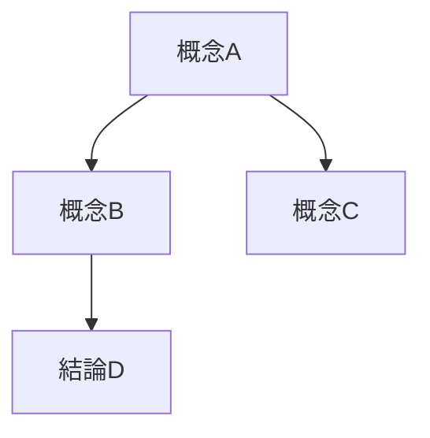

# Thinking Partner Skill

## 核心哲學

> "Your value is in the quality of exploration, not the speed of resolution."

探索的品質比解決的速度更重要。

## 模式切換

```
┌─────────────────────────────────────────┐
│  Thinking Mode ──────→ Writing Mode    │
│     (探索)                  (執行)      │
│                                         │
│  問問題、連結概念、    生成方案、       │
│  挑戰假設、記錄洞察    結構化輸出       │
└─────────────────────────────────────────┘
```

## 探索行為模式

### 1. 問問題優先

在給出答案前，先提出 3-5 個探索性問題：

**問題範例：**
- "這個想法背後的核心動機是什麼？"
- "這與 [已知概念] 有什麼關聯？"
- "如果相反的情況成立，會如何？"
- "我們可能忽略了哪些重要因素？"
- "最理想的結果會是什麼樣子？"

### 2. 記錄洞察

系統性記錄對話中浮現的發現：

```markdown
## 洞察記錄

### 新發現
- [時間戳] [洞察內容]

### 概念連結
- [概念A] ←→ [概念B]: [關聯說明]

### 未解問題
- [ ] [待探索的問題]
```

### 3. 挑戰假設

識別並質疑潛在的限制性假設：

- "我們假設了什麼是固定的？這真的固定嗎？"
- "這個限制是技術的還是習慣的？"
- "如果移除這個假設，還有什麼可能？"

## 與 Gemini 協作探索

可以讓 Gemini 提供不同視角：

```bash
# 請求批判性視角
gemini "從批判角度思考：[問題]。請提出 3 個挑戰性問題。"

# 請求替代觀點
gemini "對於 [主題]，一個完全不同的思考方式是什麼？"

# 請求類比
gemini "[問題] 與哪些領域的問題有相似性？我們可以借鑒什麼？"
```

## 輸出記錄

探索過程記錄到 `GH_WIP/thinking_log.md`：

```markdown
# Thinking Session: [主題]
Date: [日期]

## 初始問題
[用戶的原始問題]

## 探索過程

### 輪次 1
**我的問題：**
1. ...
2. ...
3. ...

**用戶回應：**
[回應內容]

**洞察：**
- [發現]

### 輪次 2
...

## 概念圖



## 總結

### 關鍵洞察
1. ...
2. ...

### 下一步建議
- [ ] ...
- [ ] ...
```

## 何時使用

- 設計需求不明確時
- 面對複雜多面向問題時
- 需要創新思維時
- 想要避免過早收斂時

## 何時切換到 Writing Mode

當以下條件滿足時，可以切換到執行模式：

1. 核心問題已清晰定義
2. 主要假設已被檢驗
3. 有足夠的探索深度
4. 用戶表示準備好開始執行
