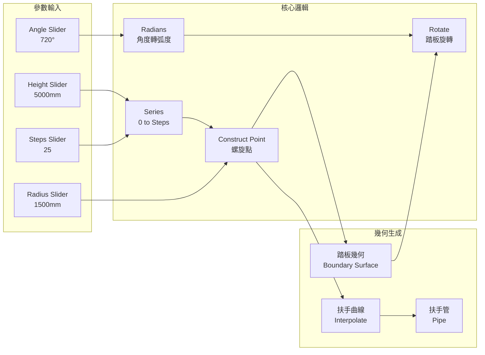

# 螺旋樓梯設計規格

## 需求摘要
- **風格**: 螺旋樓梯
- **規模**: 展覽/藝廊 (高 5m, 寬 1.5m)
- **功能**: 純幾何 + 扶手

## 參數定義

| 參數 | 數值 | 範圍 | 說明 |
|------|------|------|------|
| 總高度 | 5000 mm | 3000-8000 | 樓梯總高度 |
| 半徑 | 1500 mm | 1000-2500 | 螺旋外半徑 |
| 踏板數 | 25 | 15-40 | 踏板總數 |
| 旋轉角度 | 720° | 360-1080 | 總旋轉角度 (2 圈) |
| 踏板深度 | 280 mm | 200-350 | 踏板前後深度 |
| 踏板厚度 | 50 mm | 30-80 | 踏板厚度 |
| 扶手高度 | 900 mm | 850-1100 | 扶手高於踏板的高度 |
| 扶手直徑 | 40 mm | 30-50 | 扶手管徑 |

## 組件工作流程

## 關鍵規則 (來自 learned_patterns.json)

1. **Rotate GUID**: 必須使用 `19c70daf-600f-4697-ace2-567f6702144d`
2. **Slider 設定順序**: 先設 min/max，再設 value
3. **Radians 組件**: 輸出參數名是 "Radians" 不是 "R"

## 預期輸出

- 25 個踏板沿螺旋路徑分佈
- 720° 旋轉 (兩圈)
- 扶手沿外側螺旋曲線
