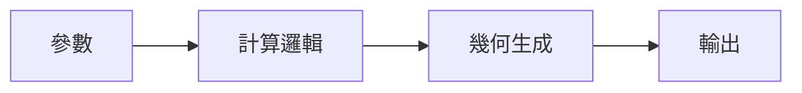
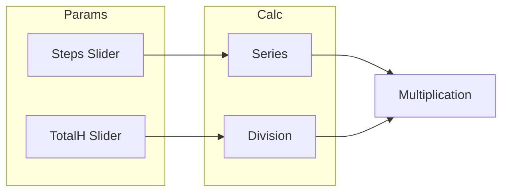
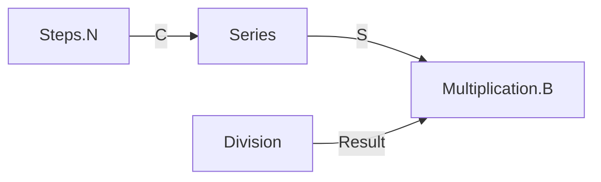

# Design-First Parametric Workflow Plan

> 設計先行的參數化建模工作流程 — 先討論架構，再執行連接

## 核心理念

從螺旋樓梯案例學到：**複雜設計不應一次衝到底**。需要：
- 分階段討論確認
- Mermaid 架構視覺化
- 智能參數名自動嘗試
- 錯誤收集統一處理

---

## 三階段設計流程

```
┌─────────────────────────────────────────────────────────────────┐
│  Phase 1: CONCEPT (概念討論)                                      │
│  ─────────────────────────────                                   │
│  • 需求釐清：用途、約束、成功標準                                   │
│  • 輸出：設計規格書 (design_spec.md)                               │
│  • 確認點：用戶同意規格後才進入下一階段                              │
└─────────────────────────────────────────────────────────────────┘
                              ↓
┌─────────────────────────────────────────────────────────────────┐
│  Phase 2: ARCHITECTURE (架構設計)                                 │
│  ─────────────────────────────────                               │
│  • Mermaid 圖：組件流程 → 參數名 → 連接關係                         │
│  • 參數驗證：預先檢查 GH 組件參數名                                  │
│  • 輸出：component_info.mmd + placement_info.json 草稿             │
│  • 確認點：用戶確認架構後才執行                                      │
└─────────────────────────────────────────────────────────────────┘
                              ↓
┌─────────────────────────────────────────────────────────────────┐
│  Phase 3: EXECUTION (GH 連接執行)                                 │
│  ─────────────────────────────────                               │
│  • 分組執行：Sliders → 計算 → 幾何 → 輸出                          │
│  • 智能重試：參數名失敗自動嘗試 R → Result → Output                 │
│  • 錯誤收集：失敗連接記錄，最後統一顯示                              │
│  • 輸出：GH 畫布 + 執行報告                                        │
└─────────────────────────────────────────────────────────────────┘
```

---

## Mermaid 架構圖分級

### Level 1: 概覽 (Quick Overview)


### Level 2: 組件流程 (Component Flow)


### Level 3: 完整連接 (Full Wiring)


---

## 智能參數名自動嘗試

### 參數名映射表
```python
PARAM_ALIASES = {
    # 常見輸出參數
    "Division": ["Result", "R"],
    "Multiplication": ["Result", "R"],
    "Addition": ["Result", "R"],
    "Subtraction": ["Result", "R"],
    "Radians": ["Radians", "R", "Result"],  # 注意：優先用全名
    "Sine": ["y", "Result"],
    "Cosine": ["y", "Result"],

    # 常見輸入參數
    "Number Slider": ["N"],
    "Construct Point": ["Pt", "Point"],
    "Center Box": ["B", "Box"],
}
```

### 自動重試邏輯
```python
def smart_connect(from_comp, from_param, to_comp, to_param):
    """嘗試連接，失敗則自動嘗試別名"""
    # 1. 嘗試原始參數名
    result = connect(from_comp, from_param, to_comp, to_param)
    if result.success:
        return result

    # 2. 查找別名
    aliases = PARAM_ALIASES.get(from_comp.type, [])
    for alias in aliases:
        if alias != from_param:
            result = connect(from_comp, alias, to_comp, to_param)
            if result.success:
                log_warning(f"Used alias: {from_param} → {alias}")
                return result

    # 3. 記錄失敗
    failed_connections.append({
        "from": f"{from_comp.nickname}.{from_param}",
        "to": f"{to_comp.nickname}.{to_param}",
        "tried": [from_param] + aliases
    })
    return None
```

---

## 實作項目

### 新增檔案
1. `grasshopper_mcp/workflow/design_workflow.py` - 三階段流程管理
2. `grasshopper_mcp/workflow/mermaid_generator.py` - Mermaid 圖生成器
3. `grasshopper_mcp/workflow/param_validator.py` - 參數名驗證器

### 修改檔案
1. `grasshopper_mcp/client_optimized.py` - 添加參數別名和自動重試 (smart_connect)

---

## 用戶體驗流程示例

```
User: 幫我設計一個螺旋樓梯

Claude:
【Phase 1: 概念討論】
我需要釐清幾個問題：
1. 階梯數量範圍？(預設 6-30)
2. 總高度範圍？(預設 150-500cm)
3. 需要扶手嗎？
4. 風格偏好？(工業/現代/極簡)

User: 12階，300cm高，要扶手，現代風格

Claude:
設計規格確認：
- 12 階梯，300cm 高
- 包含扶手
- 現代極簡風格
[繼續到架構設計？ Y/N]

User: Y

Claude:
【Phase 2: 架構設計】
[生成 Mermaid 圖]

確認組件列表：
- Sliders: Steps, TotalH, OuterR, InnerR, Rotation, StepT, HandrailH, PipeR
- 計算: Series, Division×3, Multiplication×7, Radians, Sin, Cos
- 幾何: Construct Point×3, Center Box, Rotate, Cylinder, Interpolate, Pipe

[確認架構？ Y/N]

User: Y

Claude:
【Phase 3: 執行】
正在建立 GH 連接...
[逐組執行，顯示進度]
...
完成！3 個連接需要使用別名（已自動處理）
```

---

## 驗證方法

1. **smart_connect**: 運行螺旋樓梯腳本，確認自動重試生效
2. **設計流程**: 輸入「設計一個桌子」，確認進入三階段流程
3. **Mermaid 圖**: 確認生成的圖可在 GitHub 或 VS Code 中渲染

---

*文件創建日期: 2026-01-23*
