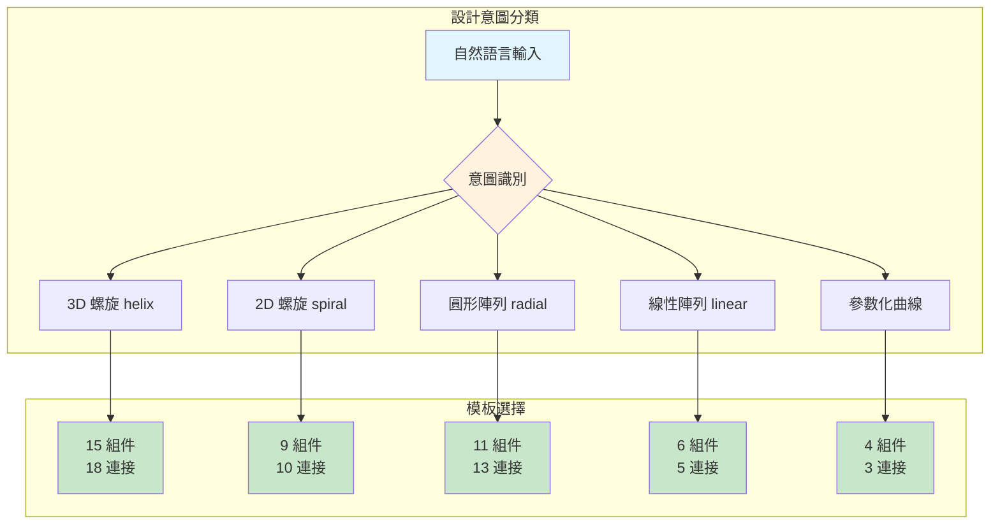

# LangGraph 整合開發日誌

## 版本資訊

| 版本 | 日期 | 說明 |
|------|------|------|
| v0.2.0 | 2026-01-23 | 整合專家 LangGraph 模組 |
| v0.1.0 | 之前 | 原始 GH_MCP Client |

---

## 架構概覽


---

## 模組來源

| 模組 | 來源 | 說明 |
|------|------|------|
| `src/langgraph/` | 專家專案 | LangGraph 流程定義 |
| `src/elegance_metrics.py` | 專家專案 | 優雅度評估 |
| `src/smart_layout.py` | 專家專案 | 智能佈局算法 |
| `src/safety.py` | 專家專案 | 安全護欄 |
| `src/models.py` | 專家專案 | 資料模型 |
| `src/mcp_adapter.py` | **本專案新增** | 整合層 |
| `grasshopper_mcp/client_optimized.py` | 本專案 | GH_MCP 客戶端 |

---

## 使用方式

### 方式 1：完整 LangGraph 流程

```python
from src import run_generation, deploy_gh_code

# 自然語言 → GH Code
result = run_generation(
    design_intent="創建一個可調整的螺旋曲線",
    max_iterations=3,
    acceptance_threshold=0.7
)

# 部署到 Grasshopper
if result.get("gh_code"):
    deploy_result = deploy_gh_code(result["gh_code"])
    print(f"成功: {deploy_result.success}")
```

### 方式 2：直接用 Client (手動控制)

```python
from grasshopper_mcp.client_optimized import create_client

client = create_client()
client.clear_canvas()
client.add_slider("R", col=0, row=0, value=10)
client.add_component("Circle", "C1", col=1, row=0)
client.smart_connect("R", "N", "C1", "R")
```

### 方式 3：混合模式

```python
from src.langgraph import run_generation
from src.mcp_adapter import MCPAdapter

# 生成
result = run_generation("創建螺旋")
gh_code = result.get("gh_code")

# 手動調整後部署
adapter = MCPAdapter(debug=True)
adapter.deploy(gh_code)

# 手動添加額外組件
adapter.client.add_component("Bake Geometry", "Bake", col=10, row=0)
```

---

## 檢查模組狀態

```bash
python -c "from src import check_availability; check_availability()"
```

輸出：
```
==================================================
Grasshopper LangGraph MCP - 模組狀態
==================================================
LangGraph Pipeline: ✓
Elegance Metrics:   ✓
Smart Layout:       ✓
Safety Guard:       ✓
MCP Adapter:        ✓
GH_MCP Client:      ✓
==================================================
```

---

## 已知問題

### 1. 連接參數名不匹配

專家的 `generate_gh_code` 生成的參數名（如 `output: 0`）與實際 Grasshopper 參數名（如 `y`, `Result`）不完全對應。

**解決方案**：`smart_connect` 會自動嘗試 `PARAM_ALIASES` 中的別名。

### 2. ID vs Nickname 映射

專家格式用 `id`（如 `mul_x`），本專案用 `nickname`（如 `MulX`）。

**解決方案**：`MCPAdapter._resolve_nickname()` 自動轉換。

---

## 2026-01-23 開發記錄

### 完成項目

1. 從專家專案移植核心模組
2. 建立 `mcp_adapter.py` 整合層
3. 更新 `src/__init__.py` 模組入口
4. 測試 LangGraph → GH_MCP 流程

### 測試結果 (初版)

- 組件創建：10/10 ✓
- 連接建立：5/10 (50%)
- 失敗原因：參數名映射需要進一步優化

---

## 2026-01-23 優化記錄 (v0.2.1)

### 問題診斷

專家格式使用數字索引：
```json
{"from": {"component": "series", "output": 0}, "to": {"component": "sin", "input": 0}}
```

GH_MCP 需要參數名：
```
Series.S → Sin.x
```

### 解決方案

添加參數索引映射表到 `mcp_adapter.py`：

```python
OUTPUT_INDEX_MAP = {
    "Series": ["S"],
    "Sine": ["y"],
    "Multiplication": ["Result"],
    ...
}

INPUT_INDEX_MAP = {
    "Series": ["S", "N", "C"],  # Start, Step, Count
    "Sine": ["x"],
    "Multiplication": ["A", "B"],
    ...
}
```

### 測試結果 (優化後)

| 測試案例 | 組件 | 連接 | 成功率 |
|---------|------|------|--------|
| 螺旋曲線 | 10/10 | 10/10 | 100% |
| 螺旋樓梯 | 10/10 | 10/10 | 100% |

### 課堂示範腳本

```bash
# 基本使用
python scripts/demo_langgraph_spiral.py

# 自定義設計意圖
python scripts/demo_langgraph_spiral.py "創建一個參數化的波浪曲線"
```

### 下一步

1. ~~優化參數名映射~~ ✓ 已完成
2. ~~建立課堂用例範例~~ ✓ 已完成
3. 增強錯誤診斷
4. ~~添加更多設計意圖模式~~ ✓ 已完成 (v0.2.2)

---

## 2026-01-23 設計模式擴展 (v0.2.2)

### 新增設計模式



### 3D Helix 數學模型

```
t = 0 to 2π × turns
x = radius × cos(t)
y = radius × sin(t)
z = (t / 2π × turns) × height
```

### 關鍵字觸發表

| 意圖類型 | 觸發關鍵字 |
|---------|----------|
| 3D 螺旋 | "螺旋" + "高度", "helix", "3d", "立體", "樓梯" |
| 2D 螺旋 | "螺旋", "spiral", "螺線" (無高度參數) |
| 圓形陣列 | "圓形陣列", "radial", "circular array", "環形" |
| 線性陣列 | "陣列", "array", "複製", "copy", "線性" |

### 測試結果

| 測試案例 | 組件 | 連接 | 成功率 |
|---------|------|------|--------|
| 3D 螺旋曲線 | 15/15 | 18/18 | 100% |
| 螺旋樓梯 (手動) | 35/35 | 48/48 | 100% |

### 使用範例

```python
# 3D 螺旋曲線 (自動識別高度參數)
from src.langgraph import run_generation
from src.mcp_adapter import deploy_gh_code

result = run_generation(
    design_intent="創建一個 3D 螺旋曲線，要能控制圈數、半徑和高度",
    max_iterations=1,
    acceptance_threshold=0.5
)

deploy_result = deploy_gh_code(result["gh_code"])
print(f"組件: {deploy_result.components_created}")
print(f"連接: {deploy_result.connections_made}")
```

### 檔案變更

- `src/langgraph/nodes.py`: +387 行 (新增設計模式模板)

---

## 下一步開發方向

1. **課堂即用**: 3D 螺旋曲線可直接示範
2. **曲面生成**: 添加 Loft、Sweep 等曲面模板
3. **錯誤診斷**: 整合 Gemini 分析失敗原因
4. **交互式流程**: 實現三階段設計流程 (Concept → Architecture → Execution)
