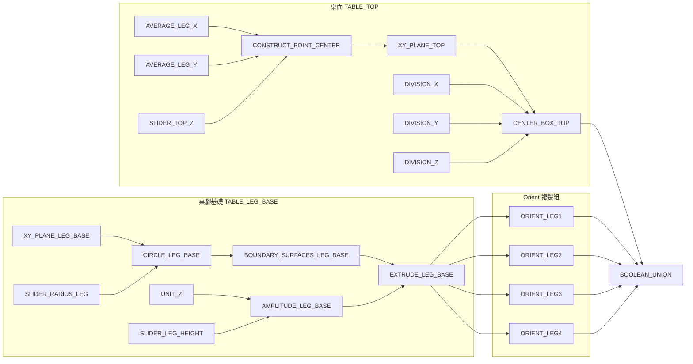

# 參數化桌子開發完整記錄

> 從 LangGraph 工作流程到 MCP 執行的完整過程
> 日期：2026-01-07 (從 git 歷史恢復)

---

## 專案概覽

### 目標
使用 GH_MCP 自動化建立一個參數化四腳桌子，包含：
- 桌面 (Center Box)
- 四個圓柱形桌腳 (Extrude + Orient)
- 合併輸出 (Solid Union)

### 最終成果
- **47 個組件**成功解析
- **66 條連接**成功建立
- 完整的 Mermaid 到 Grasshopper 工作流程

### 關鍵檔案位置
```
patterns/
├── index.json                          # Pattern Library 索引
└── parametric-table-v1/
    ├── pattern.json                    # 完整 Pattern 資料 + trusted GUIDs
    ├── flowchart.mmd                   # Mermaid 組件連接圖
    └── placement_info.json             # MCP 執行用的 JSON

scripts/
└── execute_table.py                    # 部署腳本

tests/
└── test_full_table_workflow.py         # 端到端測試

docs/
└── TABLE_DEV_LOG_ARCHIVE.md            # 原始開發記錄歸檔
```

---

## 開發時間線

### Phase 1: LangGraph 工作流程設計

**日期**: 2026-01-06 23:45

**問題識別**:
1. 原始 LangGraph 只更新內部狀態，不產出實際檔案
2. 用戶無法預覽 Mermaid 圖表
3. 缺乏「暫停等待確認」機制

**設計決策**: 採用「檔案優先」原則
```
狀態更新之前 → 先寫入 .mmd 檔案 → 暫停等待用戶預覽 → 確認後才繼續
```

### Phase 2: Mermaid Parser 開發

**日期**: 2026-01-07 00:30

**MermaidParser 設計**:
```python
class MermaidParser:
    """解析 flowchart LR 格式的 component_info.mmd"""

    def parse(self) -> dict:
        return {
            "components": {id: {...}},  # 47 個組件
            "connections": [...]        # 66 個連接
        }
```

**過濾邏輯**:
- 跳過 `subgraph` 標題（如 "桌面 TABLE_TOP"）
- 只保留有 GUID 的節點

### Phase 3: MCP 執行測試

**日期**: 2026-01-07 01:30

**測試結果**:
```
test_1_parse:      PASS (47 組件, 66 連接)
test_2_generate:   PASS
test_3_connection: PASS
test_4_subset:     PASS (5/5 組件創建成功)
```

**關鍵發現**:
- `add_component` 使用 `type`（組件名稱）✓
- `add_component` 不支持 `guid` ✗

---

## 技術細節

### 桌子幾何結構

```
┌────────────────────────────────────────┐
│              桌面 (Center Box)          │
│              120 × 80 × 5 cm           │
└────────────────────────────────────────┘
     ╱                              ╲
    ╱                                ╲
   ●                                  ●
 桌腳1                              桌腳2
(-50,-30)                         (50,-30)


   ●                                  ●
 桌腳3                              桌腳4
(-50,30)                          (50,30)
```

### 核心演算法：Orient 複製

```
1. 創建基礎桌腳 (在原點):
   XY_Plane → Circle(R=2.5) → BoundarySrf → Extrude(H=70)

2. 計算四個目標位置:
   XY_Plane + Vector(-50,-30,0) → Move → TargetPlane1
   XY_Plane + Vector(50,-30,0)  → Move → TargetPlane2
   XY_Plane + Vector(-50,30,0)  → Move → TargetPlane3
   XY_Plane + Vector(50,30,0)   → Move → TargetPlane4

3. Orient 複製:
   Extrude + SourcePlane + TargetPlane1 → Orient → Leg1
   Extrude + SourcePlane + TargetPlane2 → Orient → Leg2
   Extrude + SourcePlane + TargetPlane3 → Orient → Leg3
   Extrude + SourcePlane + TargetPlane4 → Orient → Leg4

4. 計算桌面中心:
   Average(Leg1_X, Leg2_X, Leg3_X, Leg4_X) → CenterX
   Average(Leg1_Y, Leg2_Y, Leg3_Y, Leg4_Y) → CenterY
   LegHeight + TopHeight/2 → CenterZ (72.5)

5. 創建桌面:
   Point(CenterX, CenterY, CenterZ) → XY_Plane → CenterBox(W/2, L/2, H/2)

6. 合併:
   CenterBox + Leg1 + Leg2 + Leg3 + Leg4 → SolidUnion
```

### 組件參數名對照表

| 組件類型 | 輸入參數 | 輸出參數 |
|---------|---------|---------|
| Number Slider | - | Number |
| Average | Input (Numbers) | Arithmetic mean |
| Construct Point | X, Y, Z coordinate | Point |
| XY Plane | Origin (Point) | Plane |
| Division | A, B | A/B |
| Center Box | Base (Plane), X, Y, Z | Box |
| Circle | Plane, Radius | Circle |
| Boundary Surfaces | Edges (Curves) | Surfaces |
| Unit Z | - | Vector |
| Amplitude | Vector, Amplitude | Vector |
| Extrude | Base (Surface), Direction | Result |
| Vector XYZ | X, Y, Z component | Vector |
| Move | Geometry, Motion | Geometry |
| Orient | Geometry, Source, Target | Geometry |
| Solid Union | Breps | Result |

### Trusted GUIDs

```json
{
  "Number Slider": "e2bb9b8d-0d80-44e7-aa2d-2e446f5c61da",
  "Average": "3e0451ca-da24-452d-a6b1-a6877453d4e4",
  "Construct Point": "9dceff86-6201-4c8e-90b1-706ad5bc3d49",
  "XY Plane": "a896f6c1-dd6c-4830-88f2-44808c07dc10",
  "Division": "7ed9789a-7403-4eeb-9716-d6e5681f4136",
  "Center Box": "e1f83fb4-efe0-4f10-8c20-4b38df56b36c",
  "Circle": "40dda121-a31b-421b-94b0-e46f5774f98e",
  "Boundary Surfaces": "9ec27fcf-b30f-4ad2-b2d1-c1934c32f855",
  "Unit Z": "9428ce3a-b2a0-4c8f-832a-8ad2b81a9743",
  "Amplitude": "7b93e28d-6191-425a-844e-6e9e4127dd6b",
  "Extrude": "1c5e4c65-5f57-432c-96d3-53563470ab51",
  "Vector XYZ": "d3116726-7a3e-4089-b3e2-216b266a1245",
  "Move": "6af48ec9-decb-4ad7-81ac-cd20452189a2",
  "Orient": "b08eae6f-0030-4f63-be06-9f1c7f89efd1",
  "Solid Union": "cabe86d9-6ef0-4037-90bd-01a02e0d30f0"
}
```

---

## Mermaid 圖結構

### 三個主要 Subgraph



---

## 與螺旋樓梯的比較

| 特性 | 參數化桌子 | 螺旋樓梯 |
|------|----------|---------|
| 組件數 | 47 | 35 |
| 連接數 | 66 | 48 |
| 核心演算法 | Orient 複製 | 極座標轉換 |
| 幾何類型 | Extrude + Center Box | Center Box + Cylinder + Pipe |
| 合併方式 | Solid Union | 獨立幾何（無合併） |
| 難度 | 中等 | 中等 |

### 學習重點差異

- **桌子**: Orient 複製幾何、Move 定位、Solid Union 合併
- **樓梯**: Sin/Cos 三角函數、極座標轉換、Interpolate 曲線

---

## 經驗總結

### 桌子專案特有的經驗

```
1. Average 組件很適合計算多點中心
2. Orient 比直接 Move 更適合複製完整幾何
3. 桌面高度 = 桌腳高度 + 桌面厚度/2
4. Division 用於將全尺寸轉為半尺寸（Center Box 需要）
```

### 通用 MCP 經驗

```
1. add_component 用 type（名稱），不用 guid
2. 先創建所有組件，再建立連接
3. 連接參數名用完整名稱（如 "X coordinate"）
4. 測試時先跑子集（5 個組件）再跑全部
```

---

## Pattern Library 整合

### 搜尋測試

```python
from grasshopper_mcp.pattern_library import search_patterns

results = search_patterns("桌子", top_k=3)
# 輸出:
# 1. 參數化桌子 (Parametric Table)
#    分數: 49.0 | 優雅: ⭐⭐⭐⭐ (4.0/5)
```

### 與螺旋樓梯 A/B 比對

用戶搜尋「家具」時，系統會同時返回桌子和其他相關 Pattern，讓用戶選擇或比較。

---

## 檔案恢復記錄

本文檔內容從以下 git commit 恢復：

```
5994544 feat: Complete table workflow with Mermaid parser and MCP execution
2921267 docs: Add complete table workflow test results to DEV_LOG
```

恢復的檔案：
- `GH_WIP/component_info.mmd` → `patterns/parametric-table-v1/flowchart.mmd`
- `GH_WIP/placement_info.json` → `patterns/parametric-table-v1/placement_info.json`
- `DEV_LOG.md` → `docs/TABLE_DEV_LOG_ARCHIVE.md`

---

*此文檔記錄了參數化桌子專案的完整開發過程，與螺旋樓梯並列為 Pattern Library 的基礎範例。*
