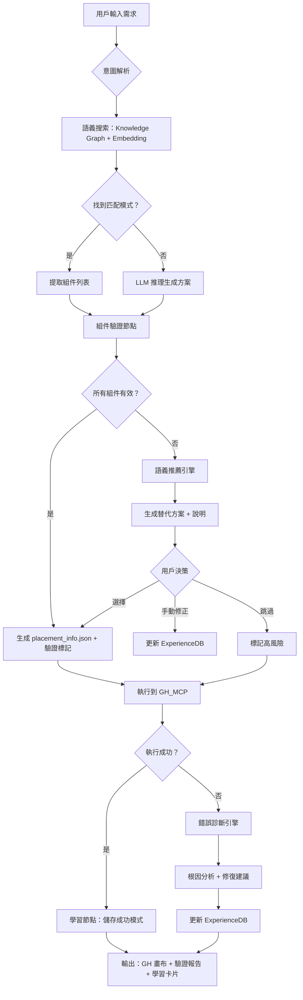

# Validation-First 智能驗證架構

> 技術規格文檔 v1.0
>
> 基於 Strudel-First 架構思想，適配 GH_MCP 專案

---

## 1. 架構總覽

### 1.1 核心理念

```
❌ 傳統：生成 → 執行 → 報錯 → 修復 → 再執行
✅ 新架構：驗證 → 推薦 → 生成 → 執行 → 學習
```

### 1.2 系統流程圖



---

## 2. 新增模組規格

### 2.1 ComponentValidator（組件驗證節點）

**檔案位置**: `grasshopper_mcp/component_validator.py`

**職責**: 在生成 placement_info.json 前，驗證所有組件是否有效

**與現有模組關係**:
- 使用 `knowledge_base.py` 的 `get_guid()` 查詢
- 使用 `pre_execution_checker.py` 的驗證邏輯
- 輸出給 `workflow_executor_v2.py` 使用

```python
"""
ComponentValidator - 組件驗證節點

整合點:
- knowledge_base.ConnectionKnowledgeBase
- pre_execution_checker.PreExecutionChecker
- experience_db.ExperienceDB
"""

from dataclasses import dataclass, field
from typing import List, Dict, Optional, Tuple
from enum import Enum

class ValidationStatus(Enum):
    VALID = "valid"                    # 唯一匹配，可直接使用
    AMBIGUOUS = "ambiguous"            # 多個候選，需要用戶選擇
    NOT_FOUND = "not_found"            # 找不到，需要推薦替代
    OBSOLETE = "obsolete"              # 找到但已棄用
    HIGH_RISK = "high_risk"            # 用戶跳過驗證

@dataclass
class ComponentValidation:
    """單個組件的驗證結果"""
    component_name: str                 # 用戶輸入的名稱
    status: ValidationStatus

    # VALID 時填充
    resolved_guid: Optional[str] = None
    resolved_name: Optional[str] = None

    # AMBIGUOUS 時填充
    candidates: List[Dict] = field(default_factory=list)
    # 格式: [{"guid": "...", "name": "...", "category": "...", "description": "..."}]

    # NOT_FOUND 時填充
    recommendations: List[Dict] = field(default_factory=list)
    # 格式: [{"name": "...", "similarity": 0.85, "reason": "名稱相似"}]

    # 所有情況都填充
    confidence: float = 0.0            # 0-1，驗證信心度
    source: str = ""                   # 來源：trusted_guids / experience_db / fuzzy_search

    # 學習卡片（可選）
    learning_card: Optional[str] = None

@dataclass
class ValidationReport:
    """整體驗證報告"""
    total_components: int
    valid_count: int
    ambiguous_count: int
    not_found_count: int

    validations: List[ComponentValidation]

    # 是否可以繼續執行
    can_proceed: bool = False
    # 需要用戶決策的項目
    requires_decision: List[str] = field(default_factory=list)

    def to_markdown(self) -> str:
        """生成人類可讀的報告"""
        pass


class ComponentValidator:
    """
    組件驗證節點

    使用方式:
        validator = ComponentValidator(kb, experience_db)
        report = validator.validate_components(component_list)

        if report.can_proceed:
            # 直接執行
            pass
        else:
            # 需要用戶決策
            for comp_name in report.requires_decision:
                validation = report.get_validation(comp_name)
                # 顯示 candidates 或 recommendations 給用戶
    """

    def __init__(
        self,
        knowledge_base: "ConnectionKnowledgeBase",
        experience_db: "ExperienceDB" = None,
        embedding_index: "EmbeddingIndex" = None
    ):
        self.kb = knowledge_base
        self.exp_db = experience_db
        self.embedding = embedding_index

        # 載入已知的多版本組件（需要特別處理）
        self.MULTI_VERSION_COMPONENTS = {
            "Rotate": ["XformComponents", "VectorComponents"],
            "Pipe": ["SurfaceComponents", "Nautilus"],
            "Series": ["Native", "Flexibility"],
            "Line": ["Primitive", "SDL"],
            "Arc": ["Primitive", "3Point"],
        }

    def validate_components(
        self,
        components: List[Dict],
        context: str = None
    ) -> ValidationReport:
        """
        驗證組件列表

        Args:
            components: [{"type": "Rotate", "nickname": "...", ...}]
            context: 可選的上下文（如「螺旋樓梯」），用於語義排序

        Returns:
            ValidationReport
        """
        validations = []

        for comp in components:
            comp_name = comp.get("type") or comp.get("name")
            validation = self._validate_single(comp_name, context)
            validations.append(validation)

        # 統計
        valid_count = sum(1 for v in validations if v.status == ValidationStatus.VALID)
        ambiguous_count = sum(1 for v in validations if v.status == ValidationStatus.AMBIGUOUS)
        not_found_count = sum(1 for v in validations if v.status == ValidationStatus.NOT_FOUND)

        # 決定是否可以繼續
        can_proceed = (ambiguous_count == 0 and not_found_count == 0)
        requires_decision = [
            v.component_name for v in validations
            if v.status in [ValidationStatus.AMBIGUOUS, ValidationStatus.NOT_FOUND]
        ]

        return ValidationReport(
            total_components=len(components),
            valid_count=valid_count,
            ambiguous_count=ambiguous_count,
            not_found_count=not_found_count,
            validations=validations,
            can_proceed=can_proceed,
            requires_decision=requires_decision
        )

    def _validate_single(self, comp_name: str, context: str = None) -> ComponentValidation:
        """驗證單個組件"""

        # Step 1: 檢查 ExperienceDB（用戶修正優先）
        if self.exp_db:
            exp_result = self.exp_db.lookup_component(comp_name)
            if exp_result and exp_result.confidence > 0.9:
                return ComponentValidation(
                    component_name=comp_name,
                    status=ValidationStatus.VALID,
                    resolved_guid=exp_result.guid,
                    resolved_name=exp_result.canonical_name,
                    confidence=exp_result.confidence,
                    source="experience_db"
                )

        # Step 2: 檢查 trusted_guids
        guid_result = self.kb.get_component_guid(comp_name)

        if guid_result:
            # 檢查是否有多版本衝突
            if comp_name in self.MULTI_VERSION_COMPONENTS:
                candidates = self._get_all_versions(comp_name)
                if len(candidates) > 1:
                    # 嘗試根據 context 排序
                    ranked = self._rank_by_context(candidates, context)
                    return ComponentValidation(
                        component_name=comp_name,
                        status=ValidationStatus.AMBIGUOUS,
                        candidates=ranked,
                        confidence=0.7,
                        source="trusted_guids",
                        learning_card=self._generate_learning_card(comp_name, candidates)
                    )

            # 單一版本，直接返回
            return ComponentValidation(
                component_name=comp_name,
                status=ValidationStatus.VALID,
                resolved_guid=guid_result.get("guid"),
                resolved_name=comp_name,
                confidence=1.0,
                source="trusted_guids"
            )

        # Step 3: 找不到，使用模糊搜索 + 語義推薦
        recommendations = self._find_similar(comp_name)

        return ComponentValidation(
            component_name=comp_name,
            status=ValidationStatus.NOT_FOUND,
            recommendations=recommendations,
            confidence=0.0,
            source="fuzzy_search",
            learning_card=f"GH 沒有名為 '{comp_name}' 的組件"
        )

    def _get_all_versions(self, comp_name: str) -> List[Dict]:
        """獲取組件的所有版本"""
        # 實作：查詢 MCP 或 trusted_guids 中的所有匹配
        pass

    def _rank_by_context(self, candidates: List[Dict], context: str) -> List[Dict]:
        """根據上下文語義排序候選項"""
        if not context or not self.embedding:
            return candidates

        # 使用 embedding 計算相似度
        # ...
        pass

    def _find_similar(self, comp_name: str) -> List[Dict]:
        """模糊搜索相似組件"""
        results = []

        # 1. 字符串相似度（Levenshtein）
        # 2. Embedding 語義相似度
        # 3. 拼音/中文映射（如果支援）

        return results

    def _generate_learning_card(self, comp_name: str, candidates: List[Dict]) -> str:
        """生成學習卡片"""
        card = f"📚 學習卡片：{comp_name}\n"
        card += f"Grasshopper 有 {len(candidates)} 個同名組件：\n"
        for c in candidates:
            card += f"  - {c['category']}/{c['name']}: {c.get('description', '')}\n"
        return card

    # === 用戶決策處理 ===

    def apply_user_decision(
        self,
        comp_name: str,
        selected_guid: str,
        save_to_experience: bool = True
    ) -> ComponentValidation:
        """
        應用用戶的選擇

        Args:
            comp_name: 原始組件名稱
            selected_guid: 用戶選擇的 GUID
            save_to_experience: 是否保存到 ExperienceDB
        """
        if save_to_experience and self.exp_db:
            self.exp_db.save_component_mapping(
                user_input=comp_name,
                resolved_guid=selected_guid,
                source="user_decision",
                confidence=0.95
            )

        return ComponentValidation(
            component_name=comp_name,
            status=ValidationStatus.VALID,
            resolved_guid=selected_guid,
            confidence=0.95,
            source="user_decision"
        )

    def skip_validation(self, comp_name: str) -> ComponentValidation:
        """用戶選擇跳過驗證（標記為高風險）"""
        return ComponentValidation(
            component_name=comp_name,
            status=ValidationStatus.HIGH_RISK,
            confidence=0.0,
            source="user_skipped",
            learning_card=f"⚠️ '{comp_name}' 跳過驗證，執行可能失敗"
        )
```

---

### 2.2 SemanticRecommender（語義推薦引擎）

**檔案位置**: `grasshopper_mcp/semantic_recommender.py`

**職責**: 當組件找不到或有多個候選時，提供語義化的推薦

**與現有模組關係**:
- 使用 `ghx_auto_learner.py` 的 `EmbeddingIndex`
- 使用 `knowledge_graph.py` 的圖譜查詢
- 被 `ComponentValidator` 調用

```python
"""
SemanticRecommender - 語義推薦引擎

整合點:
- ghx_auto_learner.EmbeddingIndex
- knowledge_graph.KnowledgeGraph
"""

from dataclasses import dataclass
from typing import List, Optional
from sentence_transformers import SentenceTransformer
import numpy as np

@dataclass
class Recommendation:
    """推薦結果"""
    name: str
    guid: Optional[str]
    similarity: float          # 0-1
    reason: str                # 推薦原因
    category: str              # Transform / Surface / Math / ...
    usage_frequency: int       # 使用頻率（來自 triplets）


class SemanticRecommender:
    """
    語義推薦引擎

    推薦策略:
    1. 字符串相似度（拼寫錯誤）
    2. Embedding 語義相似度（概念相近）
    3. 知識圖譜關聯（常見組合）
    4. 使用頻率加權
    """

    def __init__(
        self,
        embedding_index: "EmbeddingIndex",
        knowledge_graph: "KnowledgeGraph",
        model_name: str = "all-MiniLM-L6-v2"
    ):
        self.embedding_index = embedding_index
        self.kg = knowledge_graph
        self.model = SentenceTransformer(model_name)

        # 中文 → 英文映射（手動維護或 LLM 擴展）
        self.chinese_mapping = {
            "旋轉": "Rotate",
            "移動": "Move",
            "縮放": "Scale",
            "螺旋": "Helix",
            "管子": "Pipe",
            "系列": "Series",
            # ... 擴展
        }

    def recommend(
        self,
        query: str,
        context: str = None,
        top_k: int = 5
    ) -> List[Recommendation]:
        """
        生成推薦列表

        Args:
            query: 用戶輸入（可能是錯誤的組件名、中文、或描述）
            context: 上下文（如「螺旋樓梯」）
            top_k: 返回數量

        Returns:
            排序後的推薦列表
        """
        recommendations = []

        # 1. 中文映射
        if self._is_chinese(query):
            mapped = self.chinese_mapping.get(query)
            if mapped:
                recommendations.append(Recommendation(
                    name=mapped,
                    guid=self._get_guid(mapped),
                    similarity=0.95,
                    reason="中文名稱匹配",
                    category=self._get_category(mapped),
                    usage_frequency=self._get_frequency(mapped)
                ))

        # 2. 字符串相似度（Levenshtein）
        string_matches = self._string_similarity_search(query, top_k=3)
        for name, sim in string_matches:
            recommendations.append(Recommendation(
                name=name,
                guid=self._get_guid(name),
                similarity=sim * 0.8,  # 字符串相似度權重較低
                reason="名稱拼寫相似",
                category=self._get_category(name),
                usage_frequency=self._get_frequency(name)
            ))

        # 3. Embedding 語義搜索
        if self.embedding_index:
            semantic_matches = self.embedding_index.search(query, top_k=3)
            for pattern, score in semantic_matches:
                # 從 pattern 提取組件
                for comp in pattern.components[:2]:  # 取前兩個關鍵組件
                    recommendations.append(Recommendation(
                        name=comp["name"],
                        guid=comp.get("guid"),
                        similarity=score * 0.9,
                        reason=f"語義相關（來自 {pattern.design_intent} 模式）",
                        category=self._get_category(comp["name"]),
                        usage_frequency=self._get_frequency(comp["name"])
                    ))

        # 4. 如果有上下文，用知識圖譜找關聯
        if context and self.kg:
            related = self.kg.find_components_for_intent(context)
            for comp_name in related[:3]:
                recommendations.append(Recommendation(
                    name=comp_name,
                    guid=self._get_guid(comp_name),
                    similarity=0.7,
                    reason=f"常用於「{context}」場景",
                    category=self._get_category(comp_name),
                    usage_frequency=self._get_frequency(comp_name)
                ))

        # 去重 + 按 (similarity * log(frequency)) 排序
        unique = self._deduplicate(recommendations)
        ranked = sorted(unique, key=lambda r: r.similarity * np.log1p(r.usage_frequency), reverse=True)

        return ranked[:top_k]

    def _is_chinese(self, text: str) -> bool:
        """檢查是否包含中文"""
        return any('\u4e00' <= char <= '\u9fff' for char in text)

    def _string_similarity_search(self, query: str, top_k: int) -> List[tuple]:
        """字符串相似度搜索"""
        # 使用 Levenshtein 距離
        from difflib import SequenceMatcher

        all_components = self.kg.get_all_component_names() if self.kg else []
        results = []

        for name in all_components:
            ratio = SequenceMatcher(None, query.lower(), name.lower()).ratio()
            if ratio > 0.5:
                results.append((name, ratio))

        return sorted(results, key=lambda x: -x[1])[:top_k]

    def _get_guid(self, name: str) -> Optional[str]:
        """獲取組件 GUID"""
        # 從 knowledge_base 查詢
        pass

    def _get_category(self, name: str) -> str:
        """獲取組件類別"""
        pass

    def _get_frequency(self, name: str) -> int:
        """獲取使用頻率（從 triplets）"""
        pass

    def _deduplicate(self, recommendations: List[Recommendation]) -> List[Recommendation]:
        """去重，保留相似度最高的"""
        seen = {}
        for r in recommendations:
            if r.name not in seen or r.similarity > seen[r.name].similarity:
                seen[r.name] = r
        return list(seen.values())
```

---

### 2.3 ExperienceDB 擴展（動態映射庫）

**檔案位置**: `grasshopper_mcp/experience_db.py`（擴展現有）

**新增資料結構**:

```python
@dataclass
class ComponentMapping:
    """組件映射記錄（對應 Strudel 的 ExperienceDB 表格）"""
    user_input: str           # 用戶原始輸入
    resolved_guid: str        # 解析後的 GUID
    resolved_name: str        # 正規名稱
    component_type: str       # Transform / Surface / Math / Plugin
    source: str               # trusted_guids / user_decision / error_learning
    confidence: float         # 0-1
    created_at: datetime
    updated_at: datetime
    use_count: int = 0        # 使用次數（用於排序）


class ExperienceDB:
    """
    擴展現有 ExperienceDB，增加組件映射功能
    """

    # ... 現有代碼 ...

    # === 新增：組件映射 ===

    def lookup_component(self, user_input: str) -> Optional[ComponentMapping]:
        """
        查詢組件映射

        優先級:
        1. 精確匹配 user_input
        2. 不區分大小寫匹配
        3. 中文映射
        """
        pass

    def save_component_mapping(
        self,
        user_input: str,
        resolved_guid: str,
        resolved_name: str = None,
        source: str = "user_decision",
        confidence: float = 0.9
    ):
        """
        保存組件映射

        自動處理:
        - 如果已存在，更新 confidence 和 use_count
        - 記錄 updated_at
        """
        pass

    def learn_from_execution(
        self,
        placement_info: Dict,
        execution_result: Dict
    ):
        """
        從執行結果學習

        - 成功：增加相關組件的 confidence
        - 失敗：降低 confidence，記錄錯誤模式
        """
        pass

    def get_component_mapping_stats(self) -> Dict:
        """統計信息"""
        return {
            "total_mappings": ...,
            "from_trusted_guids": ...,
            "from_user_decision": ...,
            "from_error_learning": ...,
            "avg_confidence": ...
        }
```

**JSON Schema**（新增 `config/component_mappings.json`）:

```json
{
  "_meta": {
    "version": "1.0.0",
    "updated_at": "2026-01-27T10:00:00Z"
  },
  "mappings": [
    {
      "user_input": "Rotate",
      "resolved_guid": "19c70daf-600f-4697-ace2-567f6702144d",
      "resolved_name": "Rotate (Transform)",
      "component_type": "Transform",
      "source": "trusted_guids",
      "confidence": 1.0,
      "use_count": 45
    },
    {
      "user_input": "旋轉",
      "resolved_guid": "19c70daf-600f-4697-ace2-567f6702144d",
      "resolved_name": "Rotate (Transform)",
      "component_type": "Transform",
      "source": "user_decision",
      "confidence": 0.95,
      "use_count": 12
    },
    {
      "user_input": "bass_synth_1",
      "resolved_guid": null,
      "resolved_name": null,
      "component_type": null,
      "source": "error_learning",
      "confidence": 0.0,
      "note": "不存在的組件，用戶常見錯誤"
    }
  ]
}
```

---

### 2.4 LearningCard（學習卡片輸出）

**整合到現有 `pre_execution_checker.py`**:

```python
@dataclass
class LearningCard:
    """學習卡片 - 每次執行後的知識總結"""

    # 驗證結果
    validated_components: List[str]
    resolved_ambiguities: List[Dict]  # [{"input": "Rotate", "selected": "Transform/Rotate"}]
    skipped_validations: List[str]

    # 學習要點
    key_learnings: List[str]
    # 例如：["Grasshopper 有多個 Rotate 組件，Transform 類的用於幾何旋轉"]

    # 建議
    recommendations: List[str]
    # 例如：["下次使用 Rotate 時，建議指定完整路徑 Transform/Rotate"]

    def to_markdown(self) -> str:
        """生成 Markdown 格式的學習卡片"""
        md = "## 📚 學習卡片\n\n"

        if self.validated_components:
            md += "### ✅ 驗證通過\n"
            for comp in self.validated_components:
                md += f"- {comp}\n"
            md += "\n"

        if self.resolved_ambiguities:
            md += "### 🔄 已解決的歧義\n"
            for item in self.resolved_ambiguities:
                md += f"- `{item['input']}` → `{item['selected']}`\n"
            md += "\n"

        if self.skipped_validations:
            md += "### ⚠️ 跳過驗證（高風險）\n"
            for comp in self.skipped_validations:
                md += f"- {comp}\n"
            md += "\n"

        if self.key_learnings:
            md += "### 💡 關鍵學習\n"
            for learning in self.key_learnings:
                md += f"- {learning}\n"
            md += "\n"

        if self.recommendations:
            md += "### 📌 建議\n"
            for rec in self.recommendations:
                md += f"- {rec}\n"

        return md
```

---

## 3. 整合到現有工作流程

### 3.1 修改 `workflow_executor_v2.py`

```python
class WorkflowExecutorV2:
    def __init__(self, ...):
        # 現有初始化
        ...

        # 新增驗證器
        self.component_validator = ComponentValidator(
            knowledge_base=self.kb,
            experience_db=self.exp_db,
            embedding_index=self.embedding_index
        )
        self.semantic_recommender = SemanticRecommender(
            embedding_index=self.embedding_index,
            knowledge_graph=self.kg
        )

    async def execute_with_validation(
        self,
        placement_info: Dict,
        auto_resolve: bool = False
    ) -> ExecutionResult:
        """
        帶驗證的執行流程

        Args:
            placement_info: 組件和連接配置
            auto_resolve: 是否自動選擇最佳候選（不詢問用戶）
        """

        # Step 1: 驗證所有組件
        components = placement_info.get("components", [])
        validation_report = self.component_validator.validate_components(
            components,
            context=placement_info.get("_meta", {}).get("description")
        )

        # Step 2: 處理需要決策的項目
        if not validation_report.can_proceed:
            if auto_resolve:
                # 自動選擇第一個候選
                for comp_name in validation_report.requires_decision:
                    validation = validation_report.get_validation(comp_name)
                    if validation.candidates:
                        self.component_validator.apply_user_decision(
                            comp_name,
                            validation.candidates[0]["guid"],
                            save_to_experience=True
                        )
            else:
                # 返回需要用戶決策
                return ExecutionResult(
                    success=False,
                    status="requires_decision",
                    validation_report=validation_report,
                    message="部分組件需要用戶確認"
                )

        # Step 3: 更新 placement_info 中的 GUID
        resolved_placement = self._apply_resolved_guids(
            placement_info,
            validation_report
        )

        # Step 4: 執行
        result = await self._execute_placement(resolved_placement)

        # Step 5: 學習
        if result.success:
            self.exp_db.learn_from_execution(resolved_placement, result)

        # Step 6: 生成學習卡片
        result.learning_card = self._generate_learning_card(validation_report, result)

        return result
```

### 3.2 修改 `design_workflow_v2.py`

在 Phase 4.5 (Pre-Execution Check) 後增加驗證節點：

```python
class DesignWorkflowV2:
    async def phase4_5_validation(self, state: WorkflowState) -> WorkflowState:
        """Phase 4.5: 組件驗證（新增）"""

        placement_info = state.placement_info

        # 執行驗證
        report = self.component_validator.validate_components(
            placement_info["components"],
            context=state.design_intent
        )

        # 輸出驗證報告
        print(report.to_markdown())

        if not report.can_proceed:
            # 顯示推薦並等待用戶決策
            for comp_name in report.requires_decision:
                validation = report.get_validation(comp_name)

                print(f"\n⚠️ '{comp_name}' 需要確認：")

                if validation.status == ValidationStatus.AMBIGUOUS:
                    print("找到多個候選：")
                    for i, c in enumerate(validation.candidates):
                        print(f"  [{i+1}] {c['category']}/{c['name']}")

                    # 等待用戶輸入
                    choice = await self.ask_user(f"請選擇 (1-{len(validation.candidates)})：")
                    selected = validation.candidates[int(choice) - 1]
                    self.component_validator.apply_user_decision(comp_name, selected["guid"])

                elif validation.status == ValidationStatus.NOT_FOUND:
                    print("找不到此組件，推薦替代：")
                    for i, r in enumerate(validation.recommendations):
                        print(f"  [{i+1}] {r.name} ({r.reason})")

                    choice = await self.ask_user("請選擇替代 (輸入數字) 或跳過 (s)：")
                    if choice.lower() == 's':
                        self.component_validator.skip_validation(comp_name)
                    else:
                        selected = validation.recommendations[int(choice) - 1]
                        # 更新 placement_info 中的組件名
                        self._replace_component(state, comp_name, selected.name)

        state.validation_report = report
        return state
```

---

## 4. 配置文件變更

### 4.1 新增 `config/component_mappings.json`

見 2.3 節

### 4.2 更新 `config/trusted_guids.json`

增加 `multi_version` 標記：

```json
{
  "components": {
    "Rotate": {
      "guid": "19c70daf-600f-4697-ace2-567f6702144d",
      "category": "Transform",
      "multi_version": true,
      "versions": [
        {
          "guid": "19c70daf-600f-4697-ace2-567f6702144d",
          "category": "XformComponents",
          "description": "旋轉幾何物件"
        },
        {
          "guid": "另一個-guid",
          "category": "VectorComponents",
          "description": "旋轉向量"
        }
      ]
    }
  }
}
```

---

## 5. 測試計劃

### 5.1 單元測試

```python
# tests/test_component_validator.py

def test_valid_component():
    validator = ComponentValidator(kb)
    result = validator._validate_single("Number Slider")
    assert result.status == ValidationStatus.VALID
    assert result.resolved_guid is not None

def test_ambiguous_component():
    validator = ComponentValidator(kb)
    result = validator._validate_single("Rotate")
    assert result.status == ValidationStatus.AMBIGUOUS
    assert len(result.candidates) >= 2

def test_not_found_component():
    validator = ComponentValidator(kb)
    result = validator._validate_single("NonExistentComponent")
    assert result.status == ValidationStatus.NOT_FOUND
    assert len(result.recommendations) > 0

def test_chinese_input():
    recommender = SemanticRecommender(embedding_index, kg)
    results = recommender.recommend("旋轉")
    assert any(r.name == "Rotate" for r in results)
```

### 5.2 整合測試

```python
# tests/test_validation_workflow.py

async def test_full_workflow_with_validation():
    workflow = DesignWorkflowV2()

    # 模擬用戶需求
    state = WorkflowState(
        design_intent="螺旋樓梯",
        placement_info={
            "components": [
                {"type": "Rotate"},      # 會觸發 AMBIGUOUS
                {"type": "Helixx"},      # 拼錯，會觸發 NOT_FOUND
                {"type": "Series"}       # 正常
            ]
        }
    )

    # 執行驗證
    state = await workflow.phase4_5_validation(state)

    # 檢查報告
    assert state.validation_report.ambiguous_count == 1
    assert state.validation_report.not_found_count == 1
```

---

## 6. 遷移指南

### 6.1 對現有代碼的影響

| 檔案 | 影響程度 | 變更類型 |
|------|----------|----------|
| `workflow_executor_v2.py` | 高 | 新增驗證流程 |
| `design_workflow_v2.py` | 高 | 新增 Phase 4.5 |
| `experience_db.py` | 中 | 擴展組件映射功能 |
| `pre_execution_checker.py` | 低 | 整合 LearningCard |
| `knowledge_base.py` | 低 | 無變更，被調用 |
| `ghx_auto_learner.py` | 低 | 無變更，EmbeddingIndex 被調用 |

### 6.2 向後兼容性

- 新增的驗證是**可選的**，可透過 `skip_validation=True` 跳過
- 現有的 `execute_placement` 保持不變
- 新增 `execute_with_validation` 作為推薦入口

---

## 7. 未來擴展

### 7.1 LLM 驅動的語義推薦

目前的推薦基於規則和 Embedding，未來可接入 Claude API：

```python
async def llm_recommend(query: str, context: str) -> List[Recommendation]:
    prompt = f"""
    用戶想要使用一個 Grasshopper 組件，輸入是「{query}」，
    上下文是「{context}」。

    請推薦 3 個最相關的 Grasshopper 組件，並解釋原因。
    """
    response = await claude.complete(prompt)
    # 解析回應...
```

### 7.2 多語言支援

擴展 `chinese_mapping` 為多語言映射表，支援日文、韓文等。

### 7.3 插件組件驗證

目前主要驗證原生組件，未來可擴展到插件：
- WASP
- Karamba
- Kangaroo
- Ladybug/Honeybee

---

*文檔版本: 1.0*
*最後更新: 2026-01-27*
