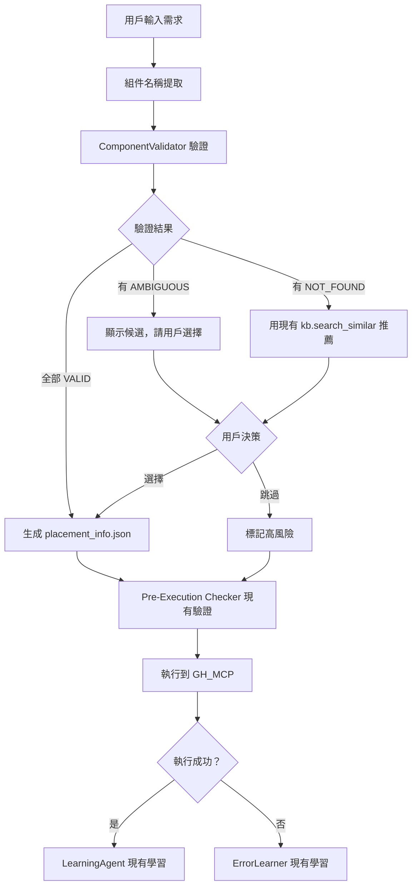

# Validation-First 組件驗證架構

> 技術規格文檔 v1.1 (精簡版)
>
> 給另一個專家實作用

---

## 1. 架構總覽

### 1.1 核心理念

```
❌ 傳統：生成 → 執行 → 報錯 → 修復 → 再執行
✅ 新架構：驗證 → 生成 → 執行 → 學習
```

### 1.2 精簡後的系統流程



---

## 2. 唯一新增模組：ComponentValidator

### 2.1 設計原則

**不重複造輪子**：
- 推薦功能 → 用現有 `knowledge_base.search_similar()`
- 學習功能 → 用現有 `LearningAgent`
- 驗證報告 → 用現有 `PreExecutionChecker.generate_report()`

**只做一件事**：
- 在 placement_info 生成前，驗證組件名稱是否有效

### 2.2 檔案位置

`grasshopper_mcp/component_validator.py` (新建)

### 2.3 完整程式碼

```python
#!/usr/bin/env python3
"""
ComponentValidator - 組件名稱驗證器 (精簡版)

職責：在生成 placement_info.json 前，驗證所有組件名稱

整合點 (只使用現有模組):
- knowledge_base.ConnectionKnowledgeBase.get_component_guid()
- knowledge_base.ConnectionKnowledgeBase.search_similar()
- pre_execution_checker.PreExecutionChecker (輔助)

使用方式:
    from grasshopper_mcp.component_validator import ComponentValidator
    from grasshopper_mcp.knowledge_base import ConnectionKnowledgeBase

    kb = ConnectionKnowledgeBase()
    validator = ComponentValidator(kb)
    report = validator.validate_components([
        {"type": "Rotate"},
        {"type": "Helixx"},  # 拼錯
        {"type": "Series"}
    ])

    if report.can_proceed:
        # 直接執行
        pass
    else:
        # 顯示 report.to_markdown() 給用戶
        pass
"""

from dataclasses import dataclass, field
from typing import List, Dict, Optional
from enum import Enum


class ValidationStatus(Enum):
    """驗證狀態"""
    VALID = "valid"           # 唯一匹配，可直接使用
    AMBIGUOUS = "ambiguous"   # 多個候選 (如 Rotate)
    NOT_FOUND = "not_found"   # 找不到


@dataclass
class ComponentValidation:
    """單個組件的驗證結果"""
    component_name: str
    status: ValidationStatus

    # VALID 時填充
    resolved_guid: Optional[str] = None
    resolved_name: Optional[str] = None

    # AMBIGUOUS 時填充
    candidates: List[Dict] = field(default_factory=list)
    # [{"guid": "...", "name": "...", "category": "..."}]

    # NOT_FOUND 時填充
    recommendations: List[Dict] = field(default_factory=list)
    # [{"name": "...", "similarity": 0.85}]

    confidence: float = 0.0
    source: str = ""  # trusted_guids / fuzzy_search


@dataclass
class ValidationReport:
    """整體驗證報告"""
    total_components: int
    valid_count: int
    ambiguous_count: int
    not_found_count: int

    validations: List[ComponentValidation] = field(default_factory=list)
    can_proceed: bool = False
    requires_decision: List[str] = field(default_factory=list)

    def get_validation(self, comp_name: str) -> Optional[ComponentValidation]:
        """根據名稱獲取驗證結果"""
        for v in self.validations:
            if v.component_name == comp_name:
                return v
        return None

    def to_markdown(self) -> str:
        """生成 Markdown 報告"""
        lines = ["## 組件驗證報告\n"]

        # 統計
        lines.append(f"- 總計: {self.total_components} 個組件")
        lines.append(f"- 通過: {self.valid_count}")
        lines.append(f"- 需選擇: {self.ambiguous_count}")
        lines.append(f"- 找不到: {self.not_found_count}")
        lines.append("")

        # 需要決策的項目
        if self.requires_decision:
            lines.append("### 需要用戶決策\n")
            for comp_name in self.requires_decision:
                v = self.get_validation(comp_name)
                if v.status == ValidationStatus.AMBIGUOUS:
                    lines.append(f"**{comp_name}** - 有多個版本:")
                    for i, c in enumerate(v.candidates):
                        lines.append(f"  [{i+1}] {c.get('category', '')}/{c.get('name', '')}")
                elif v.status == ValidationStatus.NOT_FOUND:
                    lines.append(f"**{comp_name}** - 找不到，建議:")
                    for i, r in enumerate(v.recommendations[:3]):
                        lines.append(f"  [{i+1}] {r.get('name', '')} (相似度: {r.get('similarity', 0):.0%})")
                lines.append("")

        # 結論
        if self.can_proceed:
            lines.append("### 結論: ✅ 可以繼續執行")
        else:
            lines.append("### 結論: ⚠️ 請先處理上述問題")

        return "\n".join(lines)


class ComponentValidator:
    """
    組件名稱驗證器

    只負責驗證，不負責學習或推薦（用現有模組）
    """

    # 已知有多版本衝突的組件
    MULTI_VERSION_COMPONENTS = {
        "Rotate": [
            {"guid": "19c70daf-600f-4697-ace2-567f6702144d", "name": "Rotate", "category": "Transform", "description": "旋轉幾何"},
            {"guid": "obsolete-vector-rotate", "name": "Rotate", "category": "Vector", "description": "旋轉向量 (少用)"}
        ],
        "Pipe": [
            {"guid": "1ee25749-2e2d-4fc6-9209-0ea0515081f9", "name": "Pipe", "category": "Surface", "description": "沿曲線生成管"},
            {"guid": "nautilus-pipe", "name": "Pipe", "category": "Nautilus", "description": "Nautilus 插件"}
        ],
        "Series": [
            {"guid": "651c4fa5-dff4-4be6-ba31-6dc267d3ab47", "name": "Series", "category": "Sets", "description": "數列生成"},
        ]
    }

    def __init__(self, knowledge_base: "ConnectionKnowledgeBase"):
        """
        Args:
            knowledge_base: 現有的知識庫實例
        """
        self.kb = knowledge_base

    def validate_components(
        self,
        components: List[Dict],
        context: str = None
    ) -> ValidationReport:
        """
        驗證組件列表

        Args:
            components: [{"type": "Rotate", ...}, ...]
            context: 可選上下文 (如 "螺旋樓梯")

        Returns:
            ValidationReport
        """
        validations = []

        for comp in components:
            comp_name = comp.get("type") or comp.get("name", "")
            if not comp_name:
                continue
            validation = self._validate_single(comp_name, context)
            validations.append(validation)

        # 統計
        valid_count = sum(1 for v in validations if v.status == ValidationStatus.VALID)
        ambiguous_count = sum(1 for v in validations if v.status == ValidationStatus.AMBIGUOUS)
        not_found_count = sum(1 for v in validations if v.status == ValidationStatus.NOT_FOUND)

        can_proceed = (ambiguous_count == 0 and not_found_count == 0)
        requires_decision = [
            v.component_name for v in validations
            if v.status in [ValidationStatus.AMBIGUOUS, ValidationStatus.NOT_FOUND]
        ]

        return ValidationReport(
            total_components=len(validations),
            valid_count=valid_count,
            ambiguous_count=ambiguous_count,
            not_found_count=not_found_count,
            validations=validations,
            can_proceed=can_proceed,
            requires_decision=requires_decision
        )

    def _validate_single(self, comp_name: str, context: str = None) -> ComponentValidation:
        """驗證單個組件"""

        # Step 1: 檢查是否是已知多版本組件
        if comp_name in self.MULTI_VERSION_COMPONENTS:
            candidates = self.MULTI_VERSION_COMPONENTS[comp_name]

            # 如果只有一個版本，直接返回 VALID
            if len(candidates) == 1:
                return ComponentValidation(
                    component_name=comp_name,
                    status=ValidationStatus.VALID,
                    resolved_guid=candidates[0]["guid"],
                    resolved_name=candidates[0]["name"],
                    confidence=1.0,
                    source="trusted_guids"
                )

            # 多版本，返回 AMBIGUOUS
            return ComponentValidation(
                component_name=comp_name,
                status=ValidationStatus.AMBIGUOUS,
                candidates=candidates,
                confidence=0.7,
                source="trusted_guids"
            )

        # Step 2: 查詢 trusted_guids
        guid_result = self.kb.get_component_guid(comp_name)

        if guid_result and guid_result.get("guid"):
            return ComponentValidation(
                component_name=comp_name,
                status=ValidationStatus.VALID,
                resolved_guid=guid_result["guid"],
                resolved_name=comp_name,
                confidence=1.0,
                source="trusted_guids"
            )

        # Step 3: 找不到，使用現有的 search_similar
        recommendations = []
        if hasattr(self.kb, 'search_similar'):
            similar = self.kb.search_similar(comp_name, top_k=3)
            recommendations = [
                {"name": s.get("name", ""), "similarity": s.get("score", 0)}
                for s in similar
            ]

        return ComponentValidation(
            component_name=comp_name,
            status=ValidationStatus.NOT_FOUND,
            recommendations=recommendations,
            confidence=0.0,
            source="fuzzy_search"
        )

    def apply_user_decision(
        self,
        comp_name: str,
        selected_guid: str
    ) -> ComponentValidation:
        """
        應用用戶選擇

        注意：學習功能由現有 LearningAgent 處理，這裡只返回結果
        """
        return ComponentValidation(
            component_name=comp_name,
            status=ValidationStatus.VALID,
            resolved_guid=selected_guid,
            confidence=0.95,
            source="user_decision"
        )
```

---

## 3. 整合到現有工作流程

### 3.1 修改點 1: `workflow_executor_v2.py`

在 `WorkflowExecutor.run()` 開頭增加驗證：

```python
# 在 grasshopper_mcp/workflow_executor_v2.py 的 run() 方法開頭

from .component_validator import ComponentValidator, ValidationStatus

async def run(self, request: str, ...):
    # ... 現有的意圖解析 ...

    # === 新增：組件驗證 ===
    if placement_info and placement_info.get("components"):
        validator = ComponentValidator(self.kb)
        report = validator.validate_components(
            placement_info["components"],
            context=request
        )

        if not report.can_proceed:
            # 返回報告，讓上層處理用戶決策
            return ExecutionResult(
                success=False,
                mode=ExecutionMode.WORKFLOW,
                phase=WorkflowPhase.PRE_CHECK,
                validation_report=report,  # 新增欄位
                message="部分組件需要確認"
            )

    # ... 現有的 Pre-Execution Checker ...
    # ... 現有的執行邏輯 ...
```

### 3.2 修改點 2: `design_workflow_v2.py`

在 Phase 4 (GUID 解析) 後增加驗證步驟：

```python
# 在 grasshopper_mcp/design_workflow_v2.py

async def phase4_validation(self, state):
    """Phase 4: 組件驗證"""

    from .component_validator import ComponentValidator

    validator = ComponentValidator(self.kb)
    report = validator.validate_components(
        state.placement_info["components"],
        context=state.design_intent
    )

    print(report.to_markdown())

    if not report.can_proceed:
        # HITL: 讓用戶選擇
        for comp_name in report.requires_decision:
            v = report.get_validation(comp_name)

            if v.status == ValidationStatus.AMBIGUOUS:
                choice = await self.hitl.ask_choice(
                    f"'{comp_name}' 有多個版本，請選擇：",
                    [f"{c['category']}/{c['name']}" for c in v.candidates]
                )
                selected = v.candidates[choice]
                # 更新 placement_info 中的 GUID
                self._update_guid(state, comp_name, selected["guid"])

            elif v.status == ValidationStatus.NOT_FOUND:
                if v.recommendations:
                    choice = await self.hitl.ask_choice(
                        f"找不到 '{comp_name}'，建議替代：",
                        [r["name"] for r in v.recommendations] + ["跳過"]
                    )
                    if choice < len(v.recommendations):
                        selected = v.recommendations[choice]
                        self._replace_component(state, comp_name, selected["name"])

    return state
```

---

## 4. 不需要新增的模組 (避免過度工程)

| 原提案 | 為何不需要 | 替代方案 |
|--------|-----------|---------|
| `SemanticRecommender` | `knowledge_base.search_similar()` 已有 | 直接用現有方法 |
| `ExperienceDB 擴展` | `LearningAgent` 已有學習功能 | 直接用現有模組 |
| `LearningCard` | `PreExecutionChecker.generate_report()` 已有 | 直接用現有方法 |
| `component_mappings.json` | `trusted_guids.json` 已有映射 | 擴展現有配置 |

---

## 5. 測試計劃

### 5.1 單元測試

```python
# tests/test_component_validator.py

def test_valid_component():
    """測試有效組件"""
    kb = ConnectionKnowledgeBase()
    validator = ComponentValidator(kb)

    result = validator._validate_single("Number Slider")
    assert result.status == ValidationStatus.VALID
    assert result.resolved_guid is not None

def test_ambiguous_rotate():
    """測試 Rotate 多版本"""
    kb = ConnectionKnowledgeBase()
    validator = ComponentValidator(kb)

    result = validator._validate_single("Rotate")
    assert result.status == ValidationStatus.AMBIGUOUS
    assert len(result.candidates) >= 2

def test_not_found():
    """測試找不到的組件"""
    kb = ConnectionKnowledgeBase()
    validator = ComponentValidator(kb)

    result = validator._validate_single("NonExistentXYZ")
    assert result.status == ValidationStatus.NOT_FOUND

def test_report_markdown():
    """測試報告生成"""
    kb = ConnectionKnowledgeBase()
    validator = ComponentValidator(kb)

    report = validator.validate_components([
        {"type": "Rotate"},
        {"type": "Series"},
        {"type": "Helixx"}  # 拼錯
    ])

    md = report.to_markdown()
    assert "組件驗證報告" in md
    assert "Rotate" in md
```

### 5.2 整合測試

```bash
# 手動測試流程
python -c "
from grasshopper_mcp.knowledge_base import ConnectionKnowledgeBase
from grasshopper_mcp.component_validator import ComponentValidator

kb = ConnectionKnowledgeBase()
validator = ComponentValidator(kb)

report = validator.validate_components([
    {'type': 'Rotate'},
    {'type': 'Number Slider'},
    {'type': 'Helixx'},
    {'type': 'WASP Part'}
])

print(report.to_markdown())
"
```

---

## 6. 實作優先級

| 優先級 | 任務 | 檔案 | 預估工時 |
|--------|------|------|----------|
| **P0** | ComponentValidator | `component_validator.py` (新) | 1h |
| **P1** | 整合到 workflow_executor_v2 | 修改現有 | 30min |
| **P1** | 整合到 design_workflow_v2 | 修改現有 | 30min |
| **P2** | 單元測試 | `tests/test_component_validator.py` | 30min |

**總計**: ~2.5 小時

---

## 7. 不破壞現有功能的保證

1. **新增檔案**：`component_validator.py` 是獨立模組
2. **可選整合**：workflow 可以透過參數跳過驗證
3. **不修改資料結構**：不新增 JSON 配置
4. **向後兼容**：現有 API 完全不變

---

*文檔版本: 1.1 (精簡版)*
*最後更新: 2026-01-27*
