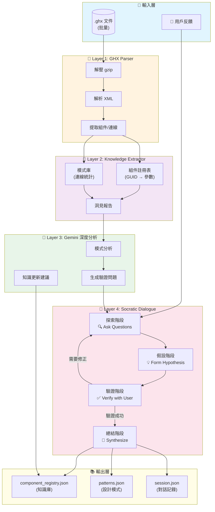
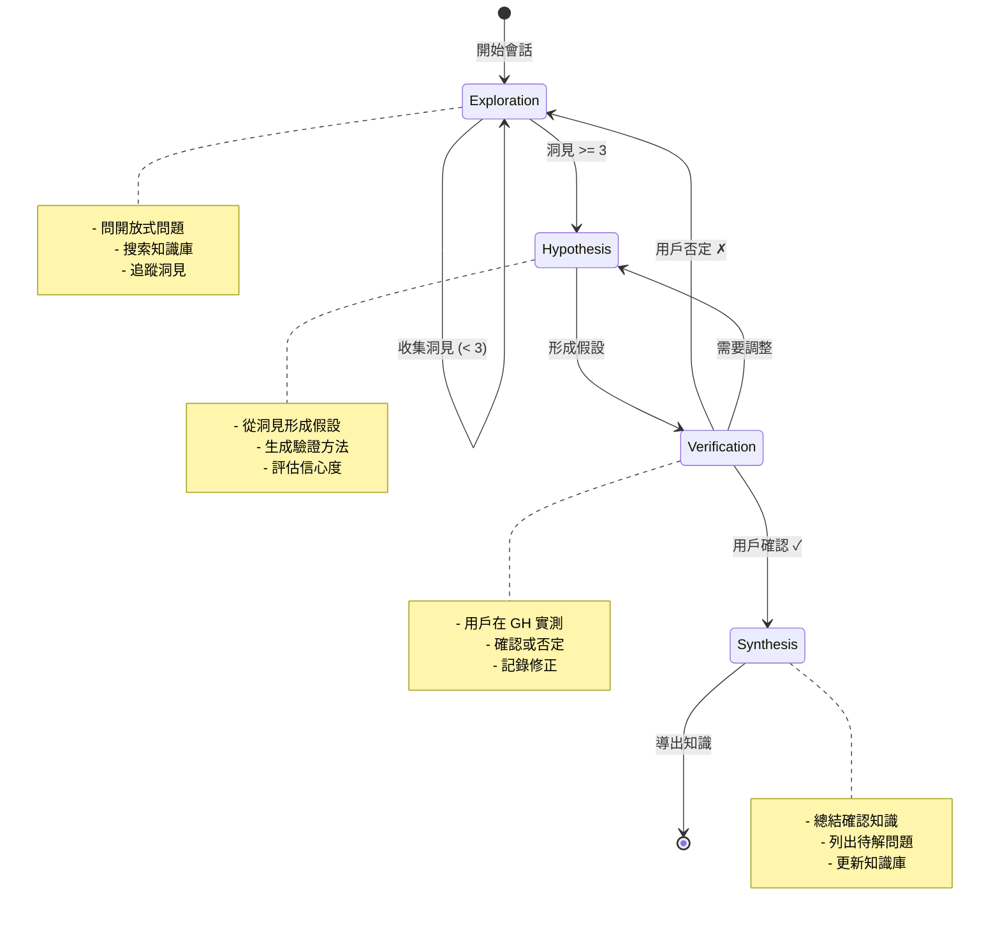
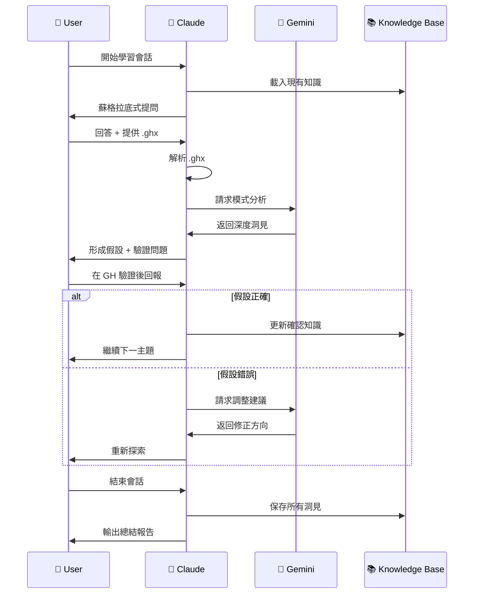
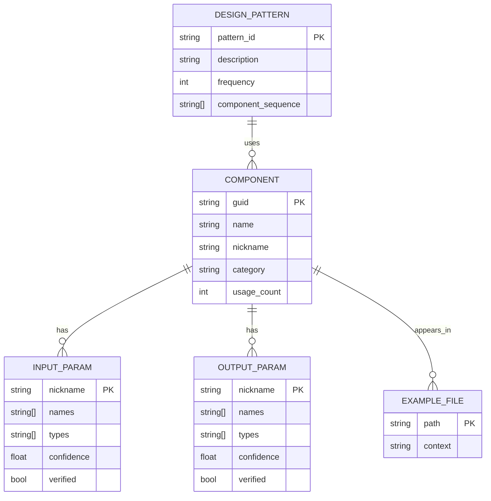
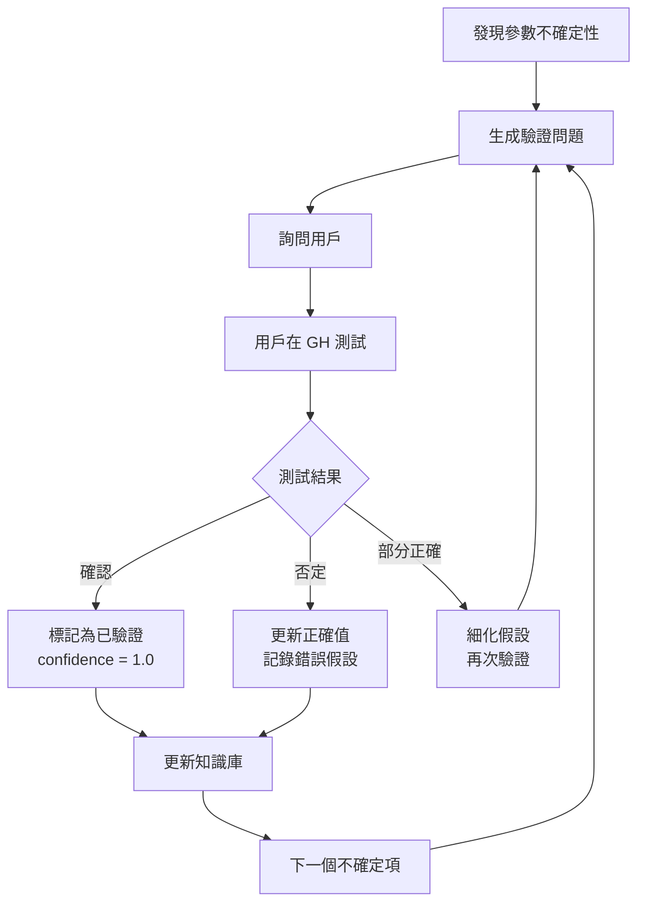

# GH-MCP 智能學習系統架構

## 核心理念

```
.ghx 批量解析 → 知識萃取 → 蘇格拉底對話 → 洞見沉澱 → 知識庫更新
      ↑                                              ↓
      └────────── Gemini 深度分析 ←──────────────────┘
```

## 整體系統流程



---

## 蘇格拉底對話流程詳解



---

## 知識萃取流程

```mermaid
flowchart LR
    subgraph Raw["原始數據"]
        A1["file1.ghx"]
        A2["file2.ghx"]
        A3["file3.ghx"]
        AN["..."]
    end

    subgraph Parse["解析結果"]
        B1["components[]"]
        B2["connections[]"]
        B3["groups[]"]
    end

    subgraph Aggregate["聚合統計"]
        C1["GUID → 使用次數"]
        C2["參數名 → 變體列表"]
        C3["連線模式 → 頻率"]
    end

    subgraph Knowledge["知識產出"]
        D1["🎯 確定參數映射<br/>'A' = 'Source'"]
        D2["⚠️ 待驗證假設<br/>'A' ∈ {'Source', 'Plane A'}"]
        D3["📊 設計模式<br/>Point → Curve → Surface"]
    end

    Raw --> Parse --> Aggregate --> Knowledge
```



---

## Claude + Gemini 協作模式



---

## 組件知識結構



---

## 驗證循環



---

## 目錄結構

```
gh_learning/
├── main.py                    # 主程式入口
├── src/
│   ├── ghx_parser.py          # Layer 1: GHX 解析器
│   ├── knowledge_extractor.py # Layer 2: 知識萃取器
│   ├── gemini_analyzer.py     # Layer 3: Gemini 分析器
│   └── socratic_dialogue.py   # Layer 4: 蘇格拉底對話 (待實作)
├── knowledge/
│   ├── component_registry.json    # 主知識庫
│   ├── extracted_knowledge.json   # 萃取結果
│   └── gemini_analysis.json       # Gemini 分析
├── ghx_samples/               # .ghx 範例文件
│   └── *.ghx
└── docs/
    └── ARCHITECTURE.md        # 本文件
```

---

## 使用方式

```bash
# 解析 .ghx 文件
python main.py parse ./ghx_samples/

# 萃取知識並用 Gemini 分析
python main.py analyze ./ghx_samples/

# 開始學習會話
python main.py learn "Orient 組件參數"

# 解釋特定組件
python main.py explain "Solid Union"
```

---

## 關鍵指標

| 指標           | 目標        | 衡量方式                  |
| -------------- | ----------- | ------------------------- |
| 解析覆蓋率     | > 95%       | 成功解析的 .ghx 數 / 總數 |
| 參數識別準確率 | > 90%       | 驗證正確的參數 / 總參數   |
| 對話效率       | < 5 輪      | 到達驗證的平均輪數        |
| 知識庫增長     | +10 組件/週 | 新增已驗證組件數          |
| 連線成功率     | > 85%       | MCP 連線成功 / 總嘗試     |
