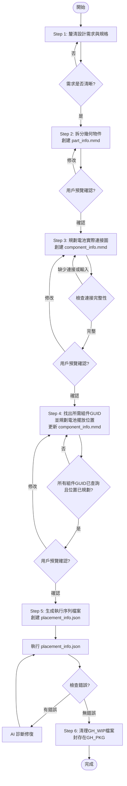
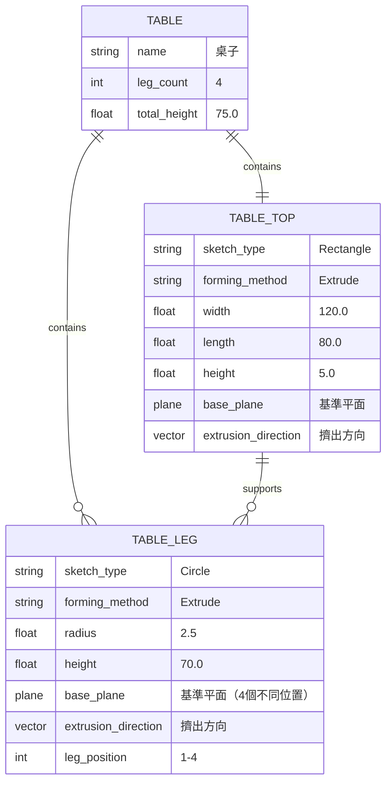
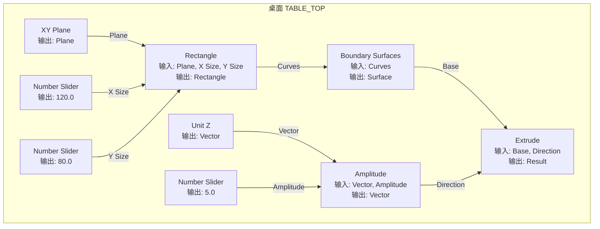
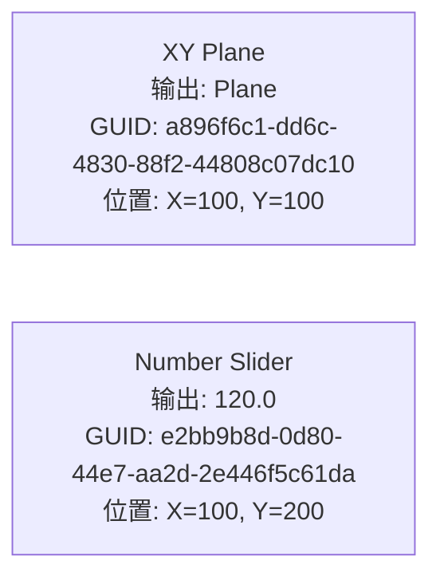

# Grasshopper Workflow Skill (Enhanced v2.0)

## 概述

此技能提供完整的 Grasshopper 參數化建模工作流程，整合了：
- **6 步驟漸進式工作流程** - 每步產出 Mermaid 檔案供預覽
- **LangGraph 狀態機** - 工作流程編排與狀態持久化
- **Claude + Gemini 協作** - 關鍵步驟的 AI 交替優化
- **人機互動檢查點** - 每步驟完成後暫停等待用戶確認

## 核心原則

> **重要**: 絕對不要跳過 Mermaid 預覽步驟！每個階段必須：
> 1. 生成 Mermaid 檔案
> 2. 展示給用戶預覽
> 3. 等待用戶確認後才繼續

```
┌─────────────────────────────────────────────────────────────┐
│                    工作流程核心原則                           │
├─────────────────────────────────────────────────────────────┤
│  1. 檔案優先：每步驟產出可預覽的 .mmd 檔案                    │
│  2. 漸進揭露：用戶確認後才進入下一階段                        │
│  3. 驗證迴圈：每步驟有明確的「進入下一階段條件」              │
│  4. AI 協作：關鍵步驟使用 Claude-Gemini 迭代優化              │
└─────────────────────────────────────────────────────────────┘
```

## 工作流程圖



---

## Step 1: 釐清設計需求與規格

**進入下一階段條件**: 已經釐清用戶需求，包含各個幾何具體的形狀成型方式以及參數需求

### 執行方式
1. 如果用戶沒有詳細描述設計規格，先跟用戶釐清
2. 如果用戶沒有提出規格，提供 2-3 個建議方案供選擇
3. 記錄關鍵參數：尺寸、材質、重複物件數量等

### AI 協作（可選）
可使用 Gemini 協助需求分析：
```bash
gemini "分析以下設計需求，提出可能的幾何分解方案：[需求描述]"
```

---

## Step 2: 拆分幾何物件創建 part_info.mmd

**進入下一階段條件**: 完成 `GH_WIP/part_info.mmd` 檔案創建，且用戶已預覽確認

### 產出檔案格式 (erDiagram)



### 規則
- 分解目標幾何物件為子物件
- 描述各子物件的成形方式（2D 草圖類型 + 3D 成形方法）
- 若有重複物件（如 4 支桌腳），使用 Orient 複製

### AI 協作優化
```bash
# Claude 提出分解方案
# Gemini 評論並優化
gemini "評估以下幾何分解方案的合理性，提出改進建議：[part_info.mmd 內容]"
```

---

## Step 3: 規劃電池實際連接圖 component_info.mmd

**進入下一階段條件**: 完成 `GH_WIP/component_info.mmd`，且連接完整性檢查通過，用戶已預覽確認

### 產出檔案格式 (flowchart LR)



### 完整性檢查
- 每個組件的輸入是否都有連接？
- 是否有孤立的組件？
- 數據流是否從左到右？

### AI 協作優化（迭代模式）
```bash
# 第 1 輪：Claude 規劃連接圖
# 第 2 輪：Gemini 檢查完整性
gemini "檢查以下 Grasshopper 連接圖的完整性，列出缺少的連接或錯誤：[component_info.mmd 內容]"
# 第 3 輪：Claude 修正
# 重複直到收斂
```

---

## Step 4: 找出所需組件 GUID 並規劃位置

**進入下一階段條件**: `component_info.mmd` 中所有組件的 GUID 已查詢並更新，所有位置已規劃，用戶已預覽確認

### 更新 component_info.mmd 格式



### 使用 MCP 工具查詢 GUID
```python
# 使用 get_component_candidates 查詢
await mcp.call("get_component_candidates", {"name": "Number Slider"})
```

### 位置規劃規則
- 同群組電池擺放在附近（間距 200-300 單位）
- 連接同一電池的組件，X 相同 Y 不同（間距 100-150 單位）
- 最小間距 50 單位，避免重疊
- 數據流從左到右排列

---

## Step 5: 生成執行序列檔案 placement_info.json

**進入下一階段條件**: 完成 `GH_WIP/placement_info.json`，且執行成功無錯誤

### 執行方式

**推薦：一鍵執行**
```bash
python -m grasshopper_tools.cli execute-full-workflow GH_WIP/placement_info.json --clear-first --max-workers 5
```

此命令自動執行：
1. 清理 Grasshopper 文檔（--clear-first）
2. 創建組件和連接（execute-placement）
3. 設置 Slider 參數（auto-set-sliders）
4. 群組組件（auto-group-components）
5. 檢查錯誤（get-errors）

### placement_info.json 格式

```json
{
  "description": "桌子創建執行序列",
  "commands": [
    {
      "comment": "=== 桌面模組 ===",
      "type": "add_component",
      "parameters": {
        "guid": "a896f6c1-dd6c-4830-88f2-44808c07dc10",
        "x": 100,
        "y": 100
      },
      "componentId": "XY_PLANE_TOP"
    },
    {
      "type": "connect_components",
      "parameters": {
        "sourceId": "XY_PLANE_TOP",
        "sourceParam": "Plane",
        "targetId": "RECTANGLE_TOP",
        "targetParam": "Plane"
      }
    }
  ]
}
```

### 錯誤診斷與修復

```bash
# 檢查錯誤
python -m grasshopper_tools.cli get-errors

# AI 協助診斷
gemini "分析以下 Grasshopper 錯誤訊息，提供修復建議：[錯誤訊息]"
```

---

## Step 6: 清理 GH_WIP 檔案

**完成條件**: GH_WIP 已清空，檔案封存到 GH_PKG

### 執行步驟
1. 在 GH_PKG 創建資料夾（格式：`YYYYMMDDHHMMSS-task_name`）
2. 移動 GH_WIP 所有檔案到新資料夾
3. 確認 GH_WIP 已清空

```bash
# 範例
mkdir -p GH_PKG/202601062300-create_table
mv GH_WIP/* GH_PKG/202601062300-create_table/
```

---

## LangGraph 整合

### 使用方式

```python
from grasshopper_mcp.langgraph import DesignState, create_workflow, WorkflowType

# 創建工作流程
workflow = create_workflow(WorkflowType.ITERATIVE)

# 初始化狀態
state = DesignState(
    topic="設計一張桌子",
    mode="iterative",
    max_iterations=5
)

# 執行（會在每個階段暫停等待確認）
state = workflow.invoke(state)
```

### AI 協作分工

| 步驟 | 主要 AI | 協作 AI | 作用 |
|------|---------|---------|------|
| Step 2 幾何拆解 | Claude | Gemini | 評論/優化 |
| Step 3 連接規劃 | Claude | Gemini | 完整性檢查 |
| Step 5 錯誤診斷 | Gemini | Claude | 分析/修復 |

---

## 快速參考

### 目錄結構
```
GH_WIP/
├── part_info.mmd          # Step 2 產出
├── component_info.mmd     # Step 3-4 產出
├── placement_info.json    # Step 5 產出
└── component_id_map.json  # 執行後自動生成

GH_PKG/
└── YYYYMMDDHHMMSS-task_name/  # Step 6 封存
```

### CLI 命令
```bash
# 完整工作流程
python -m grasshopper_tools.cli execute-full-workflow GH_WIP/placement_info.json --clear-first

# 分步驟執行
python -m grasshopper_tools.cli execute-placement GH_WIP/placement_info.json
python -m grasshopper_tools.cli auto-set-sliders GH_WIP/component_info.mmd
python -m grasshopper_tools.cli auto-group-components GH_WIP/component_info.mmd
python -m grasshopper_tools.cli get-errors
```

### Gemini 輔助命令
```bash
gemini "分析設計需求..."
gemini "評估幾何分解方案..."
gemini "檢查連接圖完整性..."
gemini "診斷執行錯誤..."
```

---

## 詳細文檔

- [工作流程步驟詳解](references/workflow_steps.md)
- [API 參考](references/api_reference.md)
- [CLI 使用說明](references/cli_usage.md)
- [工具使用指南](references/tool_guide.md)
- [LangGraph 使用指南](../../../docs/LANGGRAPH_USAGE_GUIDE.md)
